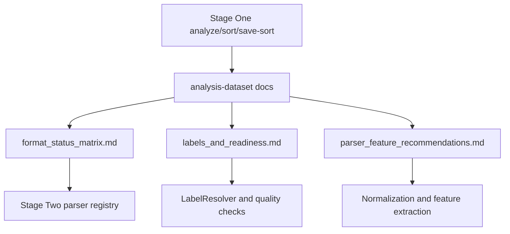

# Dataset analysis

This section records the Stage One analysis results for DNS and Host datasets and reshapes them into documentation that is usable by Stage Two normalization, the parser registry, and feature extraction.

## Structural changes

The previous per-format reports were useful as raw notes, but they duplicated the same information in many places:

- `dns/<role>/<format>.md` and `host/<role>/<format>.md` repeated the same structure for 64 format buckets;
- `general_dns_*` and `general_host_*` aggregated the same observations again;
- `analysis-dataset.md` and `dataset_labels_availability_and_recommendations.md` overlapped with normalization and label documentation.

The new structure keeps counts, statuses, labels, timestamps, readiness, and parser notes in thematic documents:

| Document | Purpose |
| --- | --- |
| [dns_datasets.md](dns_datasets.md) | DNS TRAIN/VALIDATION/TEST: formats, file counts, labels, timestamp/readiness, parser notes. |
| [host_datasets.md](host_datasets.md) | Host TRAIN/VALIDATION/TEST: data families, file counts, quality risks, parser notes. |
| [format_status_matrix.md](format_status_matrix.md) | Single matrix of 64 format buckets with readiness status and key facts. |
| [labels_and_readiness.md](labels_and_readiness.md) | Label availability, canonical label rules, readiness statuses, and anti-leakage rules. |
| [parser_feature_recommendations.md](parser_feature_recommendations.md) | Recommendations for Stage Two parser implementations and feature extraction. |
| [source_inventory.md](source_inventory.md) | Index of the old files merged into the new structure. |

Related documents:

- [../normalization/README.md](../normalization/README.md)
- [../normalization/parser_strategy.md](../normalization/parser_strategy.md)
- [../normalization/label_resolver.md](../normalization/label_resolver.md)
- [../normalization/normalized_event_schema.md](../normalization/normalized_event_schema.md)
- [../feature_extraction_and_catalogue.md](../feature_extraction_and_catalogue.md)
- [../dataset_strategy_dns_host.md](../dataset_strategy_dns_host.md)

## Analysis coverage

| Group | Format buckets | Files | Main purpose |
| --- | ---: | ---: | --- |
| `dns/TRAIN` | 3 | 26 | DNS train: CSV, PCAP, and `pcap.csv`. |
| `dns/VALIDATION` | 2 | 8 | DNS validation: PCAP and domain-list TXT. |
| `dns/TEST` | 3 | 1 | DNS test: only CSV is actually available. |
| `host/TRAIN` | 43 | 60365 | Host train: telemetry, logs, JSON/JSON Lines, traces, flows, pcap. |
| `host/VALIDATION` | 8 | 6686 | Host validation: metadata, JSON Lines, flows, traces, packet captures. |
| `host/TEST` | 5 | 294584 | Host test: BSON, CSV, JSON, logs, traces. |
| **Total** | **64** | **361670** | DNS and Host sources for feature extraction. |

## Readiness statuses

| Status | Format buckets | Files | Meaning |
| --- | ---: | ---: | --- |
| `READY_FOR_FEATURE_EXTRACTION` | 42 | 288866 | The format can be connected to feature extraction after streaming/schema-aware normalization. |
| `NEEDS_CUSTOM_PARSER` | 14 | 72666 | A specialized parser or decoder is required. |
| `PARTIALLY_SUPPORTED` | 6 | 138 | The format is partly usable, but it contains sub-schemas, service files, or requires a fixed schema. |
| `BROKEN_OR_EMPTY` | 2 | 0 | The prepared bucket contains no input files. |

## Usage invariants

1. `TRAIN`, `VALIDATION`, and `TEST` are not mixed.
2. `TEST` is not used for training, fit preprocessing, feature selection, or threshold tuning.
3. A missing label does not mean benign.
4. Filename/class hints are label sources only when an explicit mapping and audit trail exist.
5. Raw files are not modified; Stage Two must preserve traceability.
6. Missing timestamps must not be synthetically replaced with the current time.

## Summary pipeline

## Practical conclusion

The DNS branch is compact and mainly requires a DNS packet parser for PCAP/PCAPNG plus a fixed schema for DNS TEST CSV. The Host branch is large and heterogeneous: most ML value is in telemetry, log, and trace data, but the pipeline must be format-aware, streaming-friendly, and label-safe.
