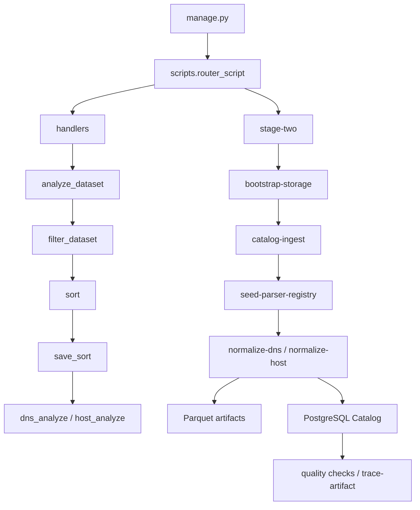

# Project Architecture

The project has two connected parts:

1. Stage One handlers in `scripts/handlers` prepare file lists, filter host datasets, sort files by role/format, and generate content-analysis reports.
2. Stage Two in `scripts/stage_two` bootstraps storage, registers raw files in the PostgreSQL Catalog, resolves active parsers, normalizes supported files into Parquet, and registers the traceability chain.

`manage.py` is the shared CLI entry point for both parts. Dataset payloads stay in file storage, while PostgreSQL stores catalog metadata, schema versions, run statuses, and artifact references.



## Main Code Areas

| Path | Purpose |
|---|---|
| `manage.py` | CLI entry point. Accepts `module`, `service`, `action` and delegates to routers. |
| `config.py` | Paths, help text, and environment-derived settings used by handlers and Stage Two. |
| `scripts/router_script.py` | Top-level routing between `handlers` and `stage-two`. |
| `scripts/handlers` | Stage One pipeline: discovery, host filtering, sorting, path export, content analysis. |
| `scripts/db` | SQLAlchemy engine/session, ORM models, and PostgreSQL Catalog repositories. |
| `scripts/stage_two` | Stage Two pipeline: storage, ingestion, parser registry, normalization, quality, traceability. |
| `schemas` | JSON Schema contracts for normalized/features/model-ready layers. |
| `docs/*/analysis-dataset` | Markdown reports generated by content-analysis handlers. |

## TRAIN / VALIDATION / TEST Separation

Roles are represented as `TRAIN`, `VALIDATION`, and `TEST` in Stage One JSON, sorted storage, PostgreSQL check constraints, and Stage Two Parquet partitioning. Stage Two does not mix roles inside normalized artifacts: `role` is stored in `dataset_files`, `parser_runs`, `normalized_artifacts`, `feature_artifacts`, and `model_ready_artifacts`.

The current code includes leakage checks in Stage Two, but complete feature/model-ready preparation is not exposed as a general CLI command. Future stages must keep fitted preprocessing state TRAIN-only; VALIDATION and TEST must remain separate evaluation roles.

## End-to-End Traceability

Traceability is implemented through the PostgreSQL Catalog:

```text
raw file -> dataset_files -> parser_runs -> normalized_artifacts -> feature_artifacts -> model_ready_artifacts
```

`TraceabilityService` can reconstruct the chain from a model-ready artifact ID or path. Normalized payloads are written to Parquet; the catalog stores paths, hashes, schema metadata, counters, and statuses.

## Implemented Today

| Area | Current state |
|---|---|
| Stage One discovery/sort/analyze | Implemented in `scripts/handlers`. |
| PostgreSQL Catalog | ORM models, Alembic migration, session layer, and repositories are implemented. |
| Storage bootstrap | Idempotently creates required Stage Two directories. |
| Catalog ingestion | Scans configured roots, computes hashes, upserts datasets/files/runs. |
| Parser registry | Seed registers schema_versions and active supported parsers. Planned/unsupported parsers are not active. |
| Normalization | DNS/host normalization services process files with status `READY_FOR_PARSING`. |
| Parquet writer | Shared APIs write normalized/feature/model-ready Parquet. |
| Quality/traceability | DuckDB checks, leakage checks, readiness check, and trace artifact CLI exist. |

## Not Implemented as a General Pipeline

| Area | Current limitation |
|---|---|
| Automatic transition to `READY_FOR_PARSING` | No public CLI command exists. `normalize-*` only reads files with that status. |
| Full feature engineering pipeline | Contracts and writer/registry APIs exist, but there is no universal CLI command to build features for all normalized artifacts. |
| Full model-ready assembly | Registry/contracts and e2e dry-run exist, but no production pipeline CLI command is implemented. |
| Host netflow/wls normalization | Parser registry keeps planned entries inactive; there is no active parser for those formats. |
