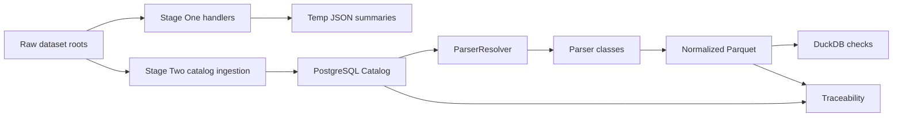

# General Architecture

The project has two main data pipeline layers:

```text
Stage One: raw filesystem analysis -> JSON summaries and reports
Stage Two: raw files -> PostgreSQL catalog -> parser normalization -> Parquet -> checks and traceability
```

## Repository Layout

| Path | Role |
| --- | --- |
| `config.py` | Central configuration for dataset roots, storage roots, report paths, temp paths, schema paths, and parser limits. |
| `manage.py` | CLI entrypoint. |
| `scripts/router_script.py` | Top-level CLI router. |
| `scripts/handlers/` | Stage One handlers. |
| `scripts/db/` | Database config, SQLAlchemy session, ORM models, repositories, Alembic migrations, DB smoke checks. |
| `scripts/stage_two/` | Stage Two storage bootstrap, ingestion, parser registry, parser implementations, normalization services, reports, quality, traceability. |
| `schemas/` | JSON contracts for normalized, feature, and model-ready artifacts. |
| `tests/stage_two/` | Tests and smoke coverage for parser and operational workflows. |
| `docs/` | RU/EN documentation for architecture, dataset analysis, and normalization. |
| `planning/` | Historical task planning and decomposition notes. |

## High-Level Flow



## Configuration Rules

All global paths and technical constants must come from `config.py`.

Important groups:

| Config group | Examples |
| --- | --- |
| Dataset roots | `PATH_FOLDER_DATASETS`, `PATH_HOST_DATASETS`, `PATH_DNS_DATASETS` |
| Storage root | `PATH_DATA_STORAGE`, `PATH_TEMP_DATA`, `PATH_LOGS` |
| Stage One artifacts | `SORT_PATH_HOST_FILE`, `SORT_PATH_DNS_FILE`, `ANALYSIS_*_SUMMARY` |
| Stage Two storage | `PARQUET_NORMALIZED_RELATIVE`, `REPORTS_EN_STAGE_TWO`, `TEMP_DATA_*_RELATIVE` |
| Schemas | `NORMALIZED_SCHEMA_PATH`, `FEATURE_ARTIFACT_SCHEMA_PATH`, `MODEL_READY_SCHEMA_PATH` |
| Parser safety | `STAGE_TWO_MAX_BASE64_DECODE_BYTES`, `STAGE_TWO_MAX_ERROR_SAMPLES`, `STAGE_TWO_MAX_RAW_PREVIEW_BYTES`, `STAGE_TWO_TEXT_ENCODINGS` |

Avoid hardcoded absolute paths in code.

## Data Ownership

| Layer | Owns | Does not own |
| --- | --- | --- |
| Stage One | Filesystem analysis reports and sorted path JSON. | PostgreSQL catalog truth, normalized Parquet. |
| Stage Two catalog | Dataset/file/parser/artifact metadata and statuses. | Full normalized payloads. |
| Stage Two parsers | Safe parsing and normalized events. | Raw file mutation, feature fitting, model training. |
| Parquet layer | Large normalized/feature/model-ready data. | Operational state transitions. |
| DuckDB/quality | Read-only analytical checks and reports. | Parser business logic. |

## Implemented Validation

Use:

```powershell
python -m compileall manage.py config.py scripts tests
git diff --check
python -m scripts.db.smoke_check
python -m scripts.stage_two.parser_smoke
python -m scripts.stage_two.parser_input_smoke
python -m scripts.stage_two.parser_catalog_smoke
python -m scripts.stage_two.cli_operational_smoke
python manage.py stage-two parser-coverage
python manage.py stage-two run-duckdb-checks
python manage.py stage-two run-leakage-checks
python -m scripts.stage_two.readiness_check
```
