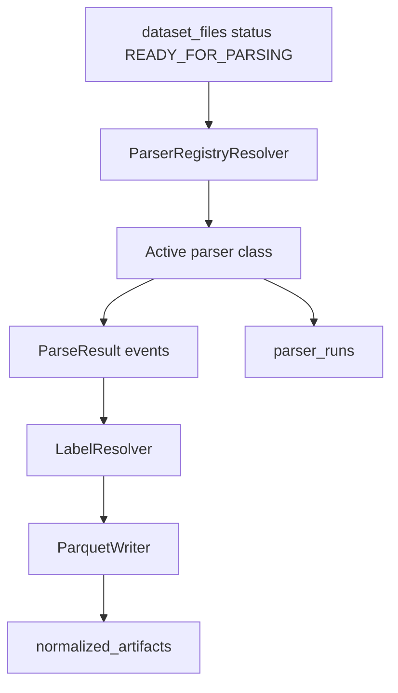

# Stage Two: Data Normalization

## Purpose

Stage Two turns the file collection produced by Stage One into a managed catalog plus normalized Parquet artifacts. Its main goal is to preserve `raw -> normalized -> features -> model-ready` traceability, keep TRAIN/VALIDATION/TEST separated, and provide a foundation for new parser implementations.

## Stage Two Packages

| Package | Purpose |
|---|---|
| `scripts/stage_two/cli.py` | CLI router for Stage Two commands. |
| `storage/bootstrap.py` | Idempotent storage directory creation. |
| `ingestion/scanner.py` | File scanning and branch/role/source_format/dataset slug inference. |
| `ingestion/file_hash_service.py` | SHA-256 hashing for raw files. |
| `ingestion/catalog_ingestion_service.py` | Creates ingestion runs and upserts datasets/dataset_files. |
| `parser_registry/seed.py` | Seeds `schema_versions` and `parser_registry`. |
| `parser_registry/resolver.py` | Selects active parser entry by branch/source_format/role/priority. |
| `parsers/base.py` | Shared parser contracts (`ParsedEvent`, `ParseResult`, base classes). |
| `parsers/dns.py` | DNS parser implementations. |
| `parsers/host.py` | Host parser implementations for supported structured/log formats. |
| `parsers/packet.py` | Packet-related parser support. |
| `parsers/bson.py` | BSON parser support. |
| `normalization/schema_contracts.py` | Loads/registers normalized schema contract. |
| `normalization/dns_service.py` | DNS normalization service. |
| `normalization/host_service.py` | Host normalization service. |
| `labels/resolver.py` | Label resolution from mapping rules/config/raw metadata. |
| `parquet/writer.py` | Writes Parquet artifacts. |
| `features/contracts.py`, `features/writer.py` | Feature artifact contract validation/writing APIs. |
| `model_ready/contracts.py`, `model_ready/registry.py` | Model-ready contract validation/registration APIs. |
| `duckdb/service.py` | DuckDB views/checks over Parquet artifacts. |
| `quality/checkers.py`, `quality/checks.py` | Data quality and leakage checks. |
| `traceability/service.py` | Reconstructs chain from model-ready to raw. |
| `readiness_check.py` | Checks Stage Two environment readiness. |
| `e2e_dry_run.py` | End-to-end dry run using sample artifacts. |

## CLI Commands

| Command | Behavior | Main outputs |
|---|---|---|
| `stage-two bootstrap-storage` | Creates storage root and required directories. | Directories under `PATH_DATA_STORAGE`. |
| `stage-two catalog-ingest` | Scans configured roots and upserts catalog rows. | `ingestion_runs`, `datasets`, `dataset_files`. |
| `stage-two seed-parser-registry` | Registers normalized schema and parser entries. | `schema_versions`, `parser_registry`. |
| `stage-two normalize-dns [limit]` | Parses READY DNS files and writes normalized Parquet. | `parser_runs`, `normalized_artifacts`, Parquet. |
| `stage-two normalize-host [limit]` | Parses READY host files and writes normalized Parquet. | `parser_runs`, `normalized_artifacts`, Parquet. |
| `stage-two run-duckdb-checks` | Builds a DuckDB analytics report. | JSON report, `data_quality_reports`. |
| `stage-two run-leakage-checks` | Checks leakage between roles/artifacts. | JSON reports, `data_quality_reports`. |
| `stage-two trace-artifact <id-or-path>` | Prints a traceability chain. | JSON chain on stdout. |

## Normalization

`normalize-dns` and `normalize-host` follow the same flow:

1. CLI selects `DatasetFileRepository.get_files_ready_for_parsing(branch, limit)`.
2. The service tries to find an active parser registry entry for `branch`, `source_format`, and `role`.
3. The resolver does not select inactive entries. Planned parser entries remain in the registry for documentation but do not participate in normalization.
4. The parser returns normalized events and counters.
5. The service writes Parquet through `ParquetWriter`.
6. The service registers `parser_runs` and `normalized_artifacts`, including schema metadata and path/hash/counters.

## Schema Versions

`seed-parser-registry` calls `seed_stage_two_metadata()`, which must register the `normalized_event` schema in `schema_versions`. Parser registry entries reference `normalized_schema_name` and `normalized_schema_version`. This is mandatory for traceability and readiness checks.

## Parser Registry Policy

- Only actually implemented parser classes should be active.
- Planned/unsupported parsers may exist in the registry only with `is_active=false` and config/status metadata.
- The resolver selects parsers by branch/source_format/role using priority and active flag.
- A new parser requires a class, seed entry, schema linkage, and a test/check proving the resolver selects it only for supported formats.

## Storage

Storage bootstrap creates directories for raw, normalized, features, model-ready, reports, config, and temp_data. Roles and branches are separated in paths and catalog metadata. The actual required directory list is in `scripts/stage_two/storage/bootstrap.py`.

## Quality and Readiness

| Component | Purpose |
|---|---|
| `DuckDBAnalyticsService` | Creates views/checks over Parquet artifacts and writes JSON report. |
| `LeakageChecker` | Checks data leakage risks between splits/artifacts. |
| `run_stage_two_readiness_check()` | Checks storage, DB, migrations/schema, parser registry, label config, catalog hashes, and writes a readiness report. |

## Current Stage Two Boundaries

- `catalog-ingest` registers files but does not expose a public CLI command to mark them `READY_FOR_PARSING` automatically.
- Feature/model-ready writer and registry APIs exist, but a general production CLI pipeline for feature/model-ready assembly is not implemented.
- Host netflow/wls planned parsers are inactive.
