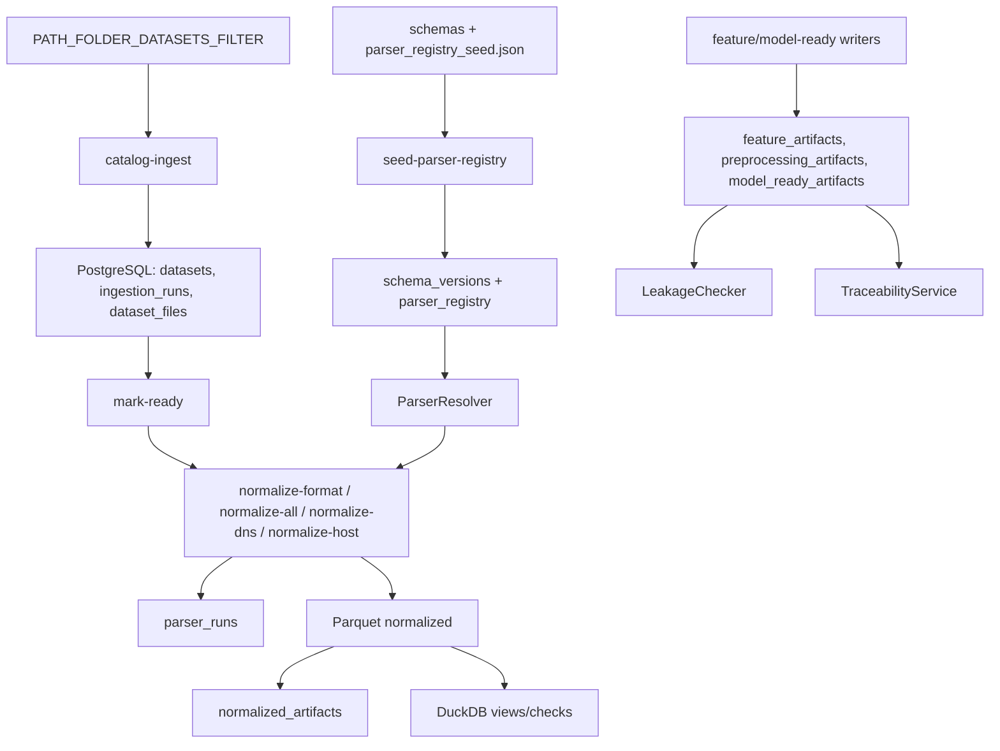

# Stage Two Overview

Stage Two converts sorted filesystem datasets into catalog-backed normalized artifacts. It keeps raw files immutable, registers metadata, resolves parsers, writes normalized events to Parquet, and provides the base for feature/model-ready layers without leakage.

## Main Code Directories

```text
scripts/stage_two/
  cli.py
  storage/bootstrap.py
  ingestion/
  parser_registry/
  parsers/
  labels/
  normalization/
  parquet/
  features/
  model_ready/
  duckdb/
  quality/
  traceability/
  splitting/
  reports/
  readiness_check.py
  e2e_dry_run.py

scripts/db/
  config.py
  session.py
  models/
  repositories/
  migrations/

schemas/
  normalized/normalized_event_v1.json
  features/feature_artifact_v1.json
  model_ready/model_ready_v1.json
```

## Data Flow



## Storage Bootstrap

File: `scripts/stage_two/storage/bootstrap.py`.

Command:

```bash
python manage.py stage-two bootstrap-storage
```

Creates the required tree under `PATH_DATA_STORAGE` without deleting existing files. Bootstrap is idempotent: existing directories are reported as `existing`, new directories as `created`.

## Catalog Ingestion

Files:

- `scripts/stage_two/ingestion/catalog_ingestion_service.py`
- `scripts/stage_two/ingestion/scanner.py`
- `scripts/stage_two/ingestion/file_hash_service.py`

Command:

```bash
python manage.py stage-two catalog-ingest
```

Input: `PATH_FOLDER_DATASETS_FILTER`.

Writes:

- `ingestion_runs`;
- `datasets`;
- `dataset_files`.

Scanner derives:

| Metadata | Source |
|---|---|
| `branch` | path parts: `dns`, `host`, `network`, `hybrid`; fallback `hybrid` |
| `role` | path parts: `TRAIN`, `VALIDATION`, `TEST`; files without active role are ignored |
| `source_format` | sorted bucket after role or filename suffix/compound suffix |
| `dataset_name` | path segment between branch and role, fallback `<branch>_<role>_<source_format>` |
| `dataset_slug` | lowercase slug |

Catalog ingestion calculates SHA-256 by streaming reads and upserts files by `(dataset_id, file_path)`.

## Parser Registry Seed

Files:

- `scripts/stage_two/parser_registry/parser_registry_seed.json`
- `scripts/stage_two/parser_registry/seed.py`
- `scripts/stage_two/parser_registry/resolver.py`
- `scripts/stage_two/normalization/schema_contracts.py`

Command:

```bash
python manage.py stage-two seed-parser-registry
```

Actions:

1. Loads `schemas/normalized/normalized_event_v1.json`.
2. Upserts `schema_versions` for `normalized_event/v1`.
3. Expands compact parser seed groups into `parser_registry` rows.
4. Validates `parser_module.parser_class`.
5. Missing or invalid active parser classes are persisted with `is_active=false` and diagnostics in `config_json`.

## Normalization Services

Files:

- `scripts/stage_two/normalization/dns_service.py`
- `scripts/stage_two/normalization/host_service.py`
- `scripts/stage_two/normalization/runner.py`
- `scripts/stage_two/normalization/options.py`

Commands:

```bash
python manage.py stage-two normalize-format --branch dns --role TRAIN --format csv --limit 10
python manage.py stage-two normalize-all --branch host --limit 100
python manage.py stage-two normalize-dns 10
python manage.py stage-two normalize-host 10
```

`normalize-format` and `normalize-all` are more controlled routes: they keep role and format boundaries explicit. Legacy `normalize-dns/host` select ready files by branch.

Normalization flow:

1. Select `dataset_files.status='READY_FOR_PARSING'`.
2. Resolve parser metadata and schema version.
3. Create or resume `parser_runs`.
4. Instantiate parser with `LabelResolver`.
5. Build `ParserContext`.
6. Read parse batches.
7. Write normalized Parquet parts with `ParquetArtifactWriter`.
8. Register `normalized_artifacts`.
9. Complete `parser_runs`.
10. Update `dataset_files.status`.
11. Save parser run reports.

Status mapping:

| Parser result | `parser_runs.status` | `dataset_files.status` |
|---|---|---|
| all rows parsed | `SUCCESS` | `PARSED` |
| some rows parsed, some failed | `PARTIAL_SUCCESS` | `PARTIALLY_PARSED` |
| read failure or no parsed rows | `FAILED` | `FAILED` |
| empty file | `SKIPPED` | `EMPTY_FILE` |
| unsupported format | `SKIPPED` | `UNSUPPORTED_FORMAT` |
| intentionally skipped helper file | `SKIPPED` | `SKIPPED` |

## Feature and Model-ready Services

Files:

- `scripts/stage_two/features/contracts.py`
- `scripts/stage_two/features/writer.py`
- `scripts/stage_two/model_ready/contracts.py`
- `scripts/stage_two/model_ready/registry.py`

Current state:

- feature writer can write prepared rows and register `feature_artifacts`;
- model-ready registry can write/register X/y/sequence/split/preprocessing artifacts;
- full feature extraction orchestration is not exposed as an end-to-end CLI pipeline yet;
- contracts enforce X excluded/forbidden columns and TRAIN-only preprocessing fit.

## DuckDB, Quality, Leakage, Traceability

DuckDB views:

- `normalized_all`;
- `features_all`;
- `model_ready_all`.

Checks cover row counts, required columns, split contamination, schema mismatch, nulls, duplicates, role/branch domains, forbidden X columns, absence of TEST in TRAIN artifacts, and preprocessing fit role.

Traceability command:

```bash
python manage.py stage-two trace-artifact <model_ready_id_or_artifact_path>
```

If any lineage link is missing, `TraceabilityError` reports the missing link.

## Current Limitations

- Feature extraction orchestration is not fully exposed as an end-to-end CLI stage.
- Model-ready creation exists as registry/writer services, but there is no full X/y build command for all branches.
- `normalize-dns/host` legacy routes are less explicit than `normalize-format`.
- Some Stage One docs may still show `NEEDS_CUSTOM_PARSER` even when Stage Two already has a parser class for part of a format. Active parser registry plus parser coverage is the authoritative current state.

## Performance Execution Architecture

Stage Two normalization now has a performance-oriented execution layer while preserving the normalized event contract.

Main files:

- `scripts/stage_two/execution/work_unit.py`;
- `scripts/stage_two/execution/planner.py`;
- `scripts/stage_two/execution/executor.py`;
- `scripts/stage_two/execution/runtime_settings.py`;
- `scripts/stage_two/execution/retry_policy.py`;
- `scripts/stage_two/execution/progress.py`;
- `scripts/stage_two/execution/format_policy.py`;
- `scripts/stage_two/benchmark.py`;
- `scripts/stage_two/quality/post_run_validation.py`.

Key behavior:

- `WorkUnitPlanner` builds work only for `dataset_files.status=READY_FOR_PARSING` and one exact `branch/role/source_format`.
- `WorkUnitExecutor` uses `ProcessPoolExecutor` for CPU parsing and bounded future submission.
- Workers do not share one SQLAlchemy session; each process opens its own DB/session context only where needed.
- Resume skips successful normalized artifacts with matching parser/schema versions.
- Parser failures are isolated to the file/chunk and can produce `PARTIAL_SUCCESS` for the command.
- Parsers expose `parse_batches` for streaming/batch parsing where possible.
- Line-based large files can be split into registered chunks with parent trace metadata.
- Binary formats (`cap`, `pcap`, `pcapng`, `bson`) are not split by the line splitter.
- `ParquetArtifactWriter` uses atomic temp-file writes and validates output before artifact registration.
- `benchmark-normalization` measures throughput and estimates whether `17 GB <= 3 hours` is feasible.
- `normalize-format` creates a post-run validation report for counts, reconciliation, split separation, leakage, and traceability.

Resource profiles:

| Profile | workers | batch_size | max_output_part_rows |
| --- | ---: | ---: | ---: |
| `safe` | 4 | 50000 | 100000 |
| `balanced` | 8 | 100000 | 250000 |
| `fast` | 12 | 200000 | 500000 |
| `aggressive` | 14 | 300000 | 750000 |

Format policy caps risky formats:

- PCAP/PCAPNG/CAP: low workers and `packet-summary` by default.
- BSON: low workers and moderate batches.
- JSON/JSONL: moderate workers.
- line-based logs/TXT/syscall traces: faster settings after benchmark validation.

Operational target:

- required throughput for 17 GB in 3 hours: about `5.67 GB/hour`;
- target on i7-14700KF / 64 GB RAM / M.2 SSD: `10-20+ GB/hour` for line-based formats;
- GPU remains an extension point for feature/model-ready/training, not a default raw parser engine.

Safety invariants are unchanged: raw files are immutable, splits are separate, `TEST` is not used for training/fit/tuning, labels are not X features, missing labels/timestamps keep their explicit null/missing semantics, and traceability must remain complete.
