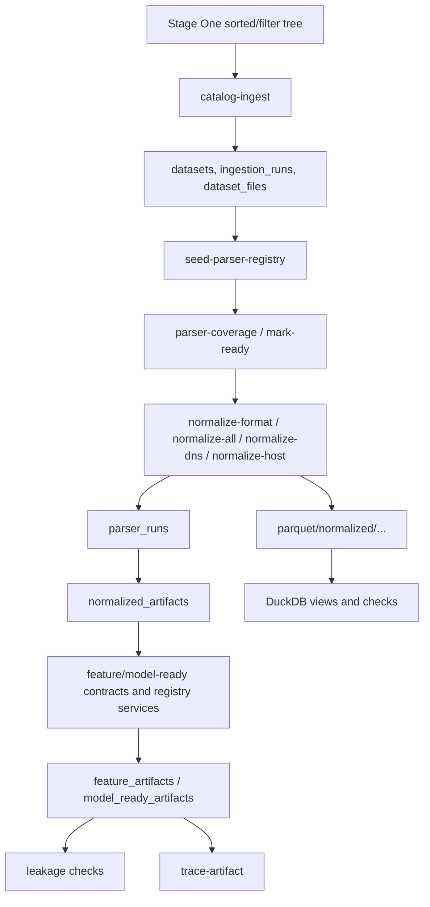

# Stage Two / Data Normalization

This section documents the implemented Stage Two pipeline: catalog ingestion, parser registry, DNS/Host normalization into normalized events, Parquet artifact writing, PostgreSQL Catalog, DuckDB/data quality/leakage checks, and traceability. It is intended for developers who need to run the pipeline, add parser implementations, and verify that roles are not mixed and leakage is not introduced.

## Stage Two Scope

Stage Two starts after Stage One has sorted or filtered the source files into the input tree. Raw files are not modified: Stage Two reads them, registers metadata in PostgreSQL, and creates new artifacts under `PATH_DATA_STORAGE`.

Implemented areas:

| Area | Implementation | Document |
| --- | --- | --- |
| CLI/routing | `manage.py`, `scripts/router_script.py`, `scripts/stage_two/cli.py` | [usage_guide.md](usage_guide.md) |
| Storage bootstrap | `scripts/stage_two/storage/bootstrap.py` | [storage_architecture.md](storage_architecture.md) |
| Catalog ingestion | `scripts/stage_two/ingestion/*` | [postgresql_catalog_schema.md](postgresql_catalog_schema.md) |
| Parser registry/resolver | `scripts/stage_two/parser_registry/*` | [parser_strategy.md](parser_strategy.md) |
| Parser development | `scripts/stage_two/parsers/*` | [parser_development_guide.md](parser_development_guide.md) |
| Label resolver | `scripts/stage_two/labels/resolver.py` | [label_resolver.md](label_resolver.md) |
| Normalized schema | `schemas/normalized/normalized_event_v1.json` | [normalized_event_schema.md](normalized_event_schema.md) |
| Parquet/DuckDB | `scripts/stage_two/parquet/*`, `scripts/stage_two/duckdb/*` | [parquet_duckdb_artifacts.md](parquet_duckdb_artifacts.md) |
| Quality checks | `scripts/stage_two/quality/checkers.py` | [data_quality_checks.md](data_quality_checks.md) |
| Leakage prevention | feature/model-ready contracts, `LeakageChecker` | [data_leakage_prevention.md](data_leakage_prevention.md) |
| Traceability | `scripts/stage_two/traceability/service.py` | [traceability.md](traceability.md) |
| Performance/runbooks | normalization options, large-file split, recovery steps | [performance_tuning.md](performance_tuning.md), [runtime_resource_runbook.md](runtime_resource_runbook.md) |

Not implemented as a dedicated CLI command in the current router: a full feature artifact and model-ready artifact build step. The contracts, writers/registry services, and e2e dry run exist, but the operational CLI currently covers catalog, parser readiness, normalization, DuckDB checks, leakage checks, and traceability.

## Recommended Reading Order

1. [usage_guide.md](usage_guide.md) - how to run Stage Two and which commands the CLI actually supports.
2. [storage_architecture.md](storage_architecture.md) - what must exist in `PATH_DATA_STORAGE`.
3. [postgresql_catalog_schema.md](postgresql_catalog_schema.md) - which metadata and relationships are stored in PostgreSQL.
4. [parser_strategy.md](parser_strategy.md) and [parser_development_guide.md](parser_development_guide.md) - how parsers are selected and how to add a new one.
5. [normalized_event_schema.md](normalized_event_schema.md) and [label_resolver.md](label_resolver.md) - normalized event contract and label rules.
6. [parquet_duckdb_artifacts.md](parquet_duckdb_artifacts.md), [data_quality_checks.md](data_quality_checks.md), [data_leakage_prevention.md](data_leakage_prevention.md), [traceability.md](traceability.md) - artifacts, checks, and lineage.
7. [performance_tuning.md](performance_tuning.md), [runtime_resource_runbook.md](runtime_resource_runbook.md), [final_summary_template.md](final_summary_template.md) - operations, recovery, and final reporting.

## Core Invariants

1. Raw dataset files are never modified.
2. `TRAIN`, `VALIDATION`, and `TEST` are not mixed in one normalized/feature/model-ready artifact.
3. `TEST` is not used for training, preprocessing fit, scaler fit, encoder fit, threshold tuning, or feature selection.
4. PostgreSQL stores metadata, statuses, relationships, paths, hashes, and reports; large normalized/features/model-ready tables are stored in Parquet.
5. DuckDB is used for analytical SQL checks over Parquet.
6. Labels are stored separately from X features.
7. Leakage/source/label fields must not enter model-ready `X` artifacts.
8. All artifacts must preserve traceability: `raw -> normalized -> features -> model-ready`.
9. Missing labels do not mean benign.
10. Filename heuristics for `TEST` labels are disabled.
11. Missing timestamps must not be replaced with current time; store `timestamp = null` and `timestamp_type = "missing"` or `event_order` when event order is available.

## Main Commands

All commands go through `manage.py`:

```bash
python manage.py stage-two bootstrap-storage
python manage.py stage-two catalog-ingest
python manage.py stage-two seed-parser-registry
python manage.py stage-two parser-coverage [dns|host|network|hybrid]
python manage.py stage-two mark-ready --branch host --role TRAIN --format auth.log --dry-run
python manage.py stage-two mark-ready --branch host --role TRAIN --format auth.log --apply
python manage.py stage-two normalize-format --branch host --role TRAIN --format auth.log --limit 100
python manage.py stage-two normalize-all --branch host --limit 1000
python manage.py stage-two split-large-files --branch host --role TRAIN --format csv --max-part-size-mb 512 --apply --register
python manage.py stage-two normalize-dns 10
python manage.py stage-two normalize-host 10
python manage.py stage-two run-duckdb-checks
python manage.py stage-two run-leakage-checks
python manage.py stage-two trace-artifact <model_ready_id_or_artifact_path>
```

Migrations and module-level checks are run separately:

```bash
alembic -c scripts/db/migrations/alembic.ini upgrade head
python -m scripts.db.smoke_check
python -m scripts.stage_two.readiness_check
python -m scripts.stage_two.e2e_dry_run
```

## Pipeline



## Terminology

| Term | Meaning |
| --- | --- |
| branch | Data branch/modality: `dns`, `host`, `network`, `hybrid`. Normalization currently supports `dns` and `host`. |
| role | Dataset split: `TRAIN`, `VALIDATION`, `TEST`. `EXPERIMENTS` exists in DB constraints, but the Stage Two catalog scanner activates only `TRAIN/VALIDATION/TEST`. |
| source_format | Source file format: `csv`, `pcap`, `pcap.csv`, `json`, `txt`, `bson`, `auth.log`, `netflow_day`, etc. |
| normalized event | One normalized record following the `normalized_event/v1` contract. |
| parser run | One parser execution for one `dataset_files.id`. |
| artifact | A Parquet or external file registered in catalog metadata. |
