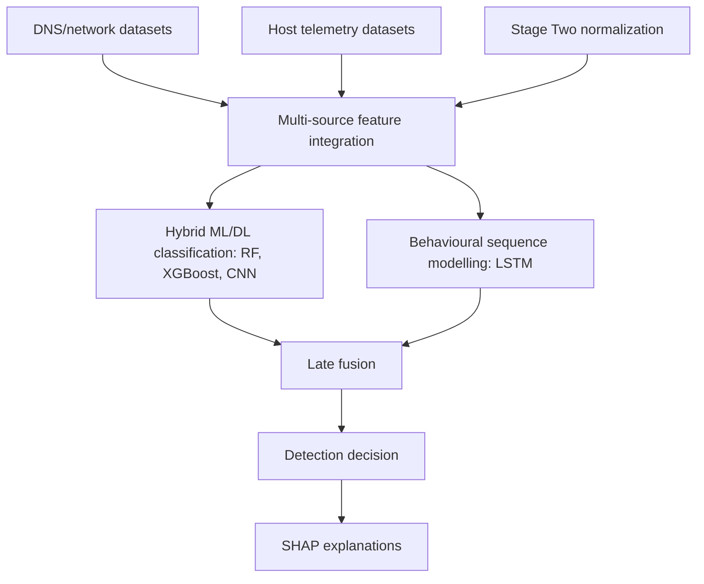

# Project overview and research context

This document merges the useful content from `project_proposal_analysis.md` and `functional_project_cheatsheet.md`. It describes the proposal-level project idea and separates the research plan from the actual repository implementation.

## Purpose

The project topic is **Behaviour-driven hybrid learning for data exfiltration detection**. The research aims to design and evaluate a hybrid ML/DL framework for detecting multi-stage data exfiltration using:

- DNS and network features;
- host-level telemetry;
- behavioural sequence modelling;
- SHAP explainability;
- role-separated dataset strategy for `TRAIN`, `VALIDATION`, and `TEST`.

## Research gap

| Limitation in existing approaches | Consequence |
| --- | --- |
| Single-modality detection: only network or only host. | The model sees an incomplete attack lifecycle. |
| Event-level classification without sequences. | Multi-stage exfiltration may be detected late or only partially. |
| Weak explainability. | SOC analysts cannot see which features drove the decision. |
| Incompatible public datasets. | Raw host/network log fusion cannot be assumed. |

Conclusion: multi-source integration should happen at the level of features, time windows, normalized events, and traceability rather than by mechanically merging raw logs.

## Proposal-level architecture

| Layer | Purpose | Status |
| --- | --- | --- |
| Multi-source integration | Normalize host/network features into one representation. | Proposal / Stage Two design target. |
| Hybrid ML/DL classification | Random Forest, XGBoost, CNN for structured/local feature patterns. | Proposal; model training code is not confirmed. |
| Behavioural sequence modelling | LSTM over ordered event sequences. | Proposal; sequence builder/model code is not confirmed. |
| Late fusion | Aggregate classifier and sequence-model probabilities. | Proposal; weights/formula are not specified. |
| SHAP explainability | Global/local explanations and rank-order consistency. | Proposal; SHAP variants are not fixed. |

## Research questions

| ID | Question | Implementation output |
| --- | --- | --- |
| RQ1 | Which cross-domain host/network features characterize exfiltration stages? | Feature catalogue and dataset-feature map. |
| RQ2 | How can classical ML and DL be combined in a hybrid architecture? | Baseline classifiers, CNN branch, ablation comparison. |
| RQ3 | How can behavioural sequence modelling be integrated? | Sequence window builder, LSTM branch, event ordering. |
| RQ4 | How does XAI improve interpretability and incident investigation? | SHAP reports, fold consistency, case studies. |

## Aim and objectives

Aim: develop and evaluate a behaviour-driven hybrid ML framework for data exfiltration detection that integrates host telemetry, network features, behavioural sequence modelling, and explainable AI.

Objectives:

1. Identify host-level and network-level features for data exfiltration detection.
2. Design a hybrid ML/DL detection architecture: RF, XGBoost, CNN, LSTM.
3. Implement behavioural sequence modelling for temporal attack patterns.
4. Integrate SHAP-based explainability.
5. Evaluate the framework on public cybersecurity benchmark datasets.

## Scope

| In scope | Out of current scope |
| --- | --- |
| Public benchmark datasets. | Live traffic capture. |
| RF, XGBoost, CNN, LSTM. | Reinforcement learning components. |
| Feature-level host/network integration. | Large-scale raw multi-dataset fusion. |
| Supervised/semi-supervised sequence modelling. | Fully unsupervised sequence modelling. |
| SHAP explainability. | Full SOC product integration. |

## Methodology

The proposal uses **Design Science Research (DSR)**:

1. Feature identification and dataset preparation.
2. Hybrid framework design.
3. Behavioural sequence modelling.
4. Explainability integration.
5. Evaluation and validation.

Planned timeline: 12 weeks, May-August 2026.

| Phase | Key deliverable | Target date |
| --- | --- | --- |
| Phase 1 | Preprocessed feature dataset with MITRE ATT&CK mappings. | May 15 |
| Phase 2 | Hybrid detection framework prototype. | June 12 |
| Phase 3 | Integrated LSTM sequence modelling component. | July 3 |
| Phase 4 | SHAP explanation module. | July 24 |
| Phase 5 | Experimental results report with comparative analysis. | August 14 |
| Report writing | Completed report and slides. | August 28 |

## Proposal-vs-implementation boundary

| Category | Status |
| --- | --- |
| Stage One dataset preparation, sorting, JSON path maps. | Confirmed by the current repository. |
| Stage Two normalization/catalog/parquet/parser design. | Partly implemented/documented; verify against code. |
| RF/XGBoost/CNN/LSTM training. | Proposal-level; model implementation is not confirmed in QA. |
| SHAP explanations. | Proposal-level. |
| Feature catalogue. | Architecture contract for future feature extraction implementation. |
