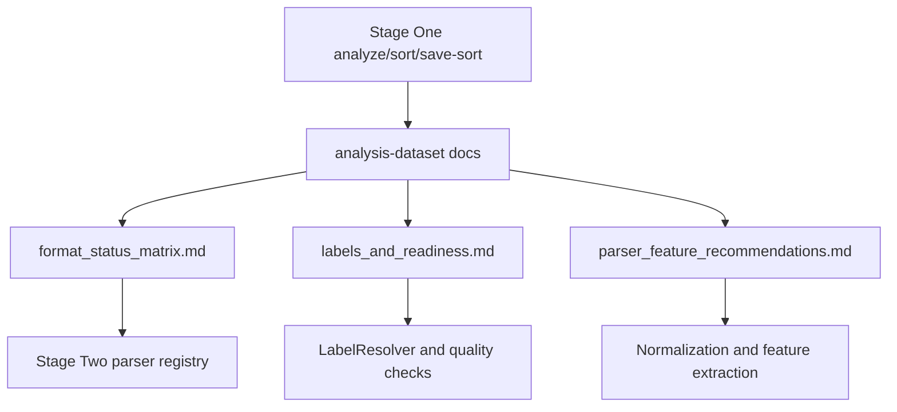

# Анализ датасетов

Раздел фиксирует результаты Stage One анализа DNS/Host датасетов и переводит их в удобную форму для Stage Two normalization, parser registry и feature extraction.

## Что изменено в структуре

Старые per-format отчеты были полезны как сырые заметки, но создавали дубли:

- `dns/<role>/<format>.md` и `host/<role>/<format>.md` повторяли одну и ту же структуру для 64 format buckets;
- `general_dns_*` и `general_host_*` агрегировали те же сведения повторно;
- `analysis-dataset.md` и `dataset_labels_availability_and_recommendations.md` частично пересекались с normalization/label docs.

Новая структура оставляет данные по counts/status/labels/timestamps/readiness в тематических документах:

| Документ | Назначение |
| --- | --- |
| [dns_datasets.md](dns_datasets.md) | DNS TRAIN/VALIDATION/TEST: форматы, количество файлов, labels, timestamp/readiness, parser notes. |
| [host_datasets.md](host_datasets.md) | Host TRAIN/VALIDATION/TEST: семейства данных, количество файлов, quality risks, parser notes. |
| [format_status_matrix.md](format_status_matrix.md) | Единая таблица 64 format buckets со статусом readiness и ключевыми фактами. |
| [labels_and_readiness.md](labels_and_readiness.md) | Label availability, canonical label rules, readiness statuses и anti-leakage правила. |
| [parser_feature_recommendations.md](parser_feature_recommendations.md) | Рекомендации для Stage Two parser implementations и feature extraction. |
| [source_inventory.md](source_inventory.md) | Индекс старых файлов, которые были объединены в новую структуру. |

Связанные документы:

- [../normalization/README.md](../normalization/README.md)
- [../normalization/parser_strategy.md](../normalization/parser_strategy.md)
- [../normalization/label_resolver.md](../normalization/label_resolver.md)
- [../normalization/normalized_event_schema.md](../normalization/normalized_event_schema.md)
- [../feature_extraction_and_catalogue.md](../feature_extraction_and_catalogue.md)
- [../dataset_strategy_dns_host.md](../dataset_strategy_dns_host.md)

## Покрытие анализа

| Группа | Format buckets | Файлов | Основной смысл |
| --- | ---: | ---: | --- |
| `dns/TRAIN` | 3 | 26 | DNS train: CSV, PCAP и `pcap.csv`. |
| `dns/VALIDATION` | 2 | 8 | DNS validation: PCAP и domain-list TXT. |
| `dns/TEST` | 3 | 1 | DNS test: фактически доступен только CSV. |
| `host/TRAIN` | 43 | 60365 | Host train: telemetry, logs, JSON/JSON-lines, traces, flows, pcap. |
| `host/VALIDATION` | 8 | 6686 | Host validation: metadata, JSON-lines, flows, traces, packet captures. |
| `host/TEST` | 5 | 294584 | Host test: BSON, CSV, JSON, logs, traces. |
| **Итого** | **64** | **361670** | DNS и Host источники для feature extraction. |

## Статусы готовности

| Статус | Format buckets | Файлов | Значение |
| --- | ---: | ---: | --- |
| `READY_FOR_FEATURE_EXTRACTION` | 42 | 288866 | Формат можно подключать к feature extraction после streaming/schema-aware normalization. |
| `NEEDS_CUSTOM_PARSER` | 14 | 72666 | Нужен специализированный parser или decoder. |
| `PARTIALLY_SUPPORTED` | 6 | 138 | Формат частично пригоден, но содержит под-схемы, служебные файлы или требует fixed schema. |
| `BROKEN_OR_EMPTY` | 2 | 0 | В подготовленном bucket нет входных файлов. |

## Инварианты использования

1. `TRAIN`, `VALIDATION` и `TEST` не смешиваются.
2. `TEST` не используется для обучения, fit preprocessing, feature selection или threshold tuning.
3. Отсутствие label не означает benign.
4. Filename/class hints являются label source только при явном mapping и audit trail.
5. Raw files не изменяются; Stage Two должен сохранять traceability.
6. Для отсутствующего timestamp нельзя синтетически подставлять текущее время.

## Сводный pipeline

## Практический вывод

DNS-часть компактная и в основном требует DNS packet parser для PCAP/PCAPNG и fixed schema для DNS TEST CSV. Host-часть крупная и неоднородная: основная ценность для ML находится в telemetry/log/trace данных, но pipeline должен быть format-aware, streaming-friendly и label-safe.
