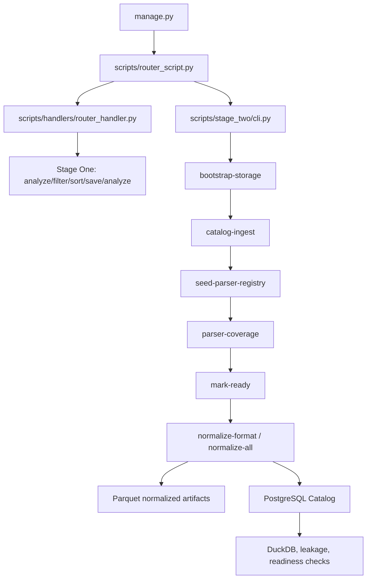

# Общая архитектура проекта

Проект состоит из двух связанных pipeline-слоев:

1. **Stage One** в `scripts/handlers` работает в основном с файловой системой и JSON-отчетами: обнаруживает датасеты, фильтрует host-ветку, сортирует файлы по ролям/форматам и строит диагностические summaries.
2. **Stage Two** в `scripts/stage_two` строит PostgreSQL Catalog на основе `PATH_FOLDER_DATASETS_FILTER`, регистрирует parser registry, нормализует filtered files в Parquet и сохраняет traceability `filtered source -> parser_run -> normalized_artifact`.

Единая точка входа - `manage.py`. Пути и константы берутся из `config.py`, настройки БД - из `scripts/db/config.py` и окружения.



## Основные директории

| Путь | Назначение |
| --- | --- |
| `manage.py` | CLI entry point. Разбирает `module`, `service`, `action` и дополнительные аргументы. |
| `config.py` | Глобальные пути storage/datasets/reports и Stage Two технические constants. |
| `scripts/router_script.py` | Маршрутизация между `handlers` и `stage-two`; для Stage Two передает `extra_args`. |
| `scripts/handlers` | Stage One handlers: discovery, filtering, sorting, save-sort, content analysis. |
| `scripts/db` | SQLAlchemy engine/session, ORM-модели, repositories, Alembic migrations и DB smoke check. |
| `scripts/stage_two` | Catalog ingestion, parser registry, parsers, normalization, reports, quality, traceability. |
| `schemas` | JSON Schema контракты normalized/features/model-ready artifacts. |
| `docs` | RU/EN документация проекта. |
| `reports` / `storage/reports` | Generated reports в зависимости от config path. |

## Поток данных

```text
raw datasets
  -> Stage One JSON diagnostics and sorted trees
  -> PATH_FOLDER_DATASETS_FILTER
  -> Stage Two catalog ingestion
  -> dataset_files rows with branch/role/source_format/status/hash
  -> parser registry resolution
  -> parser run
  -> normalized Parquet
  -> normalized_artifacts rows
  -> DuckDB/leakage/readiness checks
```

Stage Two не использует Stage One JSON как единственный production input. `catalog-ingest` сканирует `PATH_FOLDER_DATASETS_FILTER`, вычисляет hashes и upsert-ит PostgreSQL Catalog. Stage One JSON остается полезным диагностическим источником и совместимым legacy artifact. `PATH_FOLDER_DATASETS` сохраняется для immutable raw sources и аудита, но не является рабочим источником Stage Two.

## Роли и разделение данных

Проект использует роли `TRAIN`, `VALIDATION`, `TEST`. Они присутствуют в Stage One JSON, sorted tree, `dataset_files`, `parser_runs`, `normalized_artifacts` и Parquet partition path. Нормализация не должна смешивать роли: `normalize-format` выбирает один `branch/role/source_format`, а `normalize-all` обрабатывает ветку группами по role/source_format.

Leakage-guard правила:

- TEST filename heuristic отключен;
- labels берутся только из безопасных embedded fields или `label_mapping_rules`;
- traceability fields остаются metadata/context, а не model input features;
- missing label записывается как `label_binary=None`, `label_status="unlabeled"`.

## Реализованное состояние

| Область | Текущее состояние |
| --- | --- |
| Stage One | Discovery/filter/sort/save-sort/content-analysis handlers реализованы. |
| PostgreSQL Catalog | ORM models, repositories, Alembic migration и `scripts.db.smoke_check` реализованы. |
| Storage bootstrap | Идемпотентно создает Stage Two storage/report/parquet directories. |
| Catalog ingestion | Сканирует `PATH_FOLDER_DATASETS_FILTER`, определяет branch/role/source_format, считает SHA-256, upsert-ит catalog rows. |
| Parser registry | Seed регистрирует schema_versions и active parser entries для реализованных parser classes. |
| Parser coverage | CLI строит coverage matrix и RU/EN reports. |
| Mark-ready | CLI переводит только разрешенные статусы в `READY_FOR_PARSING`, по умолчанию dry-run. |
| Normalization | `normalize-format`, `normalize-all`, `normalize-dns`, `normalize-host` пишут normalized Parquet и catalog rows. |
| Reports | Parser/normalization diagnostics пишутся в RU/EN report directories. |
| Checks | DuckDB, leakage, readiness и direct/catalog smokes доступны как отдельные команды/модули. |

## Что является ограничением

| Область | Ограничение |
| --- | --- |
| Feature pipeline | `feature_artifacts` contracts/writers существуют, но общего production CLI для feature extraction нет. |
| Model-ready pipeline | `model_ready_artifacts` contracts/registry существуют, но full production assembly CLI не реализован. |
| Stage One naming | Файлы документации `hadlers_*` сохраняют историческую опечатку ради совместимости ссылок. |
| CLI help in config | `config.manage_commands` может отставать от новых Stage Two команд; фактический список нужно проверять в `scripts/stage_two/cli.py`. |
| Heavy corpus validation | Документация описывает реализованные команды; full-corpus success можно утверждать только после реального запуска на полном наборе данных. |
