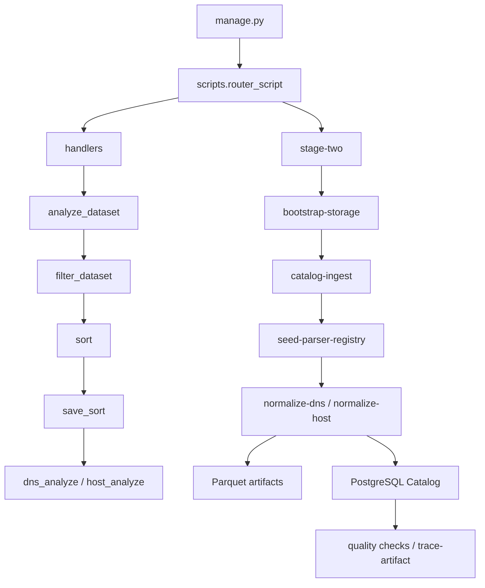

# Общая архитектура проекта

Проект состоит из двух связанных частей:

1. Stage One handlers в `scripts/handlers` готовят файловые списки, фильтруют host-датасеты, раскладывают файлы по ролям/форматам и строят отчеты анализа содержимого.
2. Stage Two в `scripts/stage_two` создает структуру storage, регистрирует raw-файлы в PostgreSQL Catalog, выбирает активные парсеры, нормализует поддерживаемые файлы в Parquet и регистрирует traceability-цепочку.

`manage.py` является единой CLI-точкой входа для обеих частей. Данные датасетов остаются в файловом хранилище, а PostgreSQL хранит каталог, версии схем, статусы запусков и ссылки на артефакты.



## Основные директории кода

| Директория | Назначение |
|---|---|
| `manage.py` | CLI entry point. Принимает `module`, `service`, `action` и передает управление router-слою. |
| `config.py` | Пути, команды помощи и настройки окружения, используемые handlers и Stage Two. |
| `scripts/router_script.py` | Верхнеуровневая маршрутизация между `handlers` и `stage-two`. |
| `scripts/handlers` | Stage One pipeline: discovery, host filtering, sorting, path export, content analysis. |
| `scripts/db` | SQLAlchemy engine/session, ORM-модели и репозитории PostgreSQL Catalog. |
| `scripts/stage_two` | Stage Two pipeline: storage, ingestion, parser registry, normalization, quality, traceability. |
| `schemas` | JSON Schema контракты normalized/features/model-ready. |
| `docs/*/analysis-dataset` | Markdown-отчеты, создаваемые content-analysis handlers. |

## Разделение ролей TRAIN / VALIDATION / TEST

В коде роли представлены как `TRAIN`, `VALIDATION`, `TEST` и используются в JSON Stage One, в sorted storage, в PostgreSQL check constraints и в Parquet partitioning Stage Two. Stage Two не смешивает роли внутри normalized artifacts: `role` записывается в `dataset_files`, `parser_runs`, `normalized_artifacts`, `feature_artifacts`, `model_ready_artifacts`.

Текущий код содержит проверки leakage на уровне Stage Two, но полная feature/model-ready подготовка не является общей CLI-командой. Для будущих этапов важно сохранять правило: fit/preprocessing выполняется только на TRAIN, VALIDATION/TEST используются как отдельные роли и не должны влиять на fitted state.

## Сквозная traceability

Фактическая traceability строится через PostgreSQL Catalog:

```text
raw file -> dataset_files -> parser_runs -> normalized_artifacts -> feature_artifacts -> model_ready_artifacts
```

`TraceabilityService` умеет восстановить цепочку от model-ready artifact по ID или пути. Нормализованные данные записываются в Parquet, а каталог хранит пути, hash, schema metadata, счетчики и статусы.

## Что уже реализовано

| Область | Фактическое состояние |
|---|---|
| Stage One discovery/sort/analyze | Реализовано в `scripts/handlers`. |
| PostgreSQL Catalog | ORM-модели, Alembic migration, session/repository слой реализованы. |
| Storage bootstrap | Создает требуемые директории Stage Two идемпотентно. |
| Catalog ingestion | Сканирует настроенные корни, вычисляет hash, upsert-ит datasets/files/runs. |
| Parser registry | Seed регистрирует schema_versions и активные поддерживаемые парсеры. Planned/unsupported парсеры не активируются. |
| Normalization | Реализованы DNS/host normalization services для файлов со статусом `READY_FOR_PARSING`. |
| Parquet writer | Записывает normalized/feature/model-ready Parquet через общие writer APIs. |
| Quality/traceability | Есть DuckDB checks, leakage checks, readiness check и trace artifact CLI. |

## Что не реализовано как общий pipeline

| Область | Текущее ограничение |
|---|---|
| Автоматический перевод catalog files в `READY_FOR_PARSING` | Публичной CLI-команды нет. `normalize-*` берет только файлы с этим статусом. |
| Полный feature engineering pipeline | Есть контракты и writer/registry APIs, но нет универсальной CLI-команды построения features из всех normalized artifacts. |
| Полная model-ready сборка | Есть registry/contracts и e2e dry-run, но нет общей CLI-команды production pipeline. |
| Host netflow/wls normalization | Parser registry хранит planned entries inactive; активный parser для этих форматов отсутствует. |
