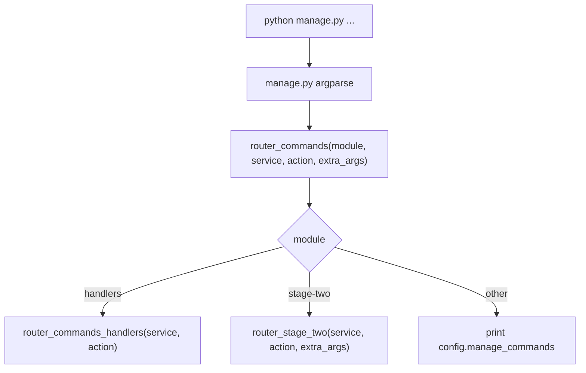

# CLI и router architecture

## `manage.py`

`manage.py` - единственная верхнеуровневая CLI-точка входа. Он использует `argparse` и принимает:

```text
module
service
action
extra_args
```

`extra_args` читаются через `argparse.REMAINDER`, поэтому Stage Two команды могут иметь собственные flags:

```powershell
python manage.py stage-two mark-ready --branch host --role TRAIN --format auth.log --dry-run
python manage.py stage-two normalize-format --branch dns --role TRAIN --format csv --limit 10
```

## `scripts/router_script.py`

Router разделяет две ветки:

| `module` | Куда передается управление | Extra args |
| --- | --- | --- |
| `handlers` | `scripts.handlers.router_handler.router_commands_handlers(service, action)` | Не используются. |
| `stage-two` | `scripts.stage_two.cli.router_stage_two(service, action, extra_args=extra_args)` | Передаются в Stage Two CLI. |

Неизвестный `module` печатает `config.manage_commands`. Неизвестная Stage Two команда печатает структурированную ошибку/help через `scripts/stage_two/cli.py`.



## Stage One command style

Stage One сохраняет исторический формат:

```powershell
python manage.py handlers analyze-dataset host-dataset-handler
python manage.py handlers sort sort-dns-dataset-handler
python manage.py handlers save-sort save-sort-host-dataset-handler
```

В этой ветке `service` - группа handlers, `action` - конкретный handler. Business logic находится в `scripts/handlers/*`.

## Stage Two command style

Stage Two поддерживает оба формата: современный flag-based CLI и fallback-представление в `action` для backward compatibility.

### Operational commands

```powershell
python manage.py stage-two bootstrap-storage
python manage.py stage-two seed-parser-registry
python manage.py stage-two catalog-ingest
python manage.py stage-two parser-coverage
python manage.py stage-two parser-coverage host
python manage.py stage-two parser-coverage dns
python manage.py stage-two mark-ready --branch host --role TRAIN --format auth.log --dry-run
python manage.py stage-two mark-ready --branch host --role TRAIN --format auth.log --apply
python manage.py stage-two normalize-format --branch host --role TRAIN --format auth.log --limit 100
python manage.py stage-two normalize-all --branch dns --limit 1000
```

### Backward-compatible forms

```powershell
python manage.py stage-two mark-ready dry-run:host:TRAIN:auth.log
python manage.py stage-two mark-ready apply:host:TRAIN:auth.log
python manage.py stage-two normalize-format host:TRAIN:auth.log:100
python manage.py stage-two normalize-all host:100
```

### Legacy aliases

```powershell
python manage.py stage-two normalize-dns 100
python manage.py stage-two normalize-host 100
```

Эти aliases сохраняются для совместимости и используют тот же runner/service layer, что и новые команды.

## Почему extra args важны

Новые Stage Two команды требуют scoped аргументы (`--branch`, `--role`, `--format`, `--limit`, `--apply`). Если `manage.py` теряет extra args, команда превращается в неоднозначный вызов. Поэтому контракт router layer такой:

```text
manage.py parses generic command
router_script keeps Stage Two extra args
scripts/stage_two/cli.py parses command-specific flags
```

## Практическая проверка

Минимальные проверки router behavior:

```powershell
python -m compileall manage.py scripts
python manage.py stage-two parser-coverage
python manage.py stage-two mark-ready --branch host --role TRAIN --format auth.log --dry-run
python manage.py stage-two normalize-format host:TRAIN:auth.log:1
```

DB-dependent команды требуют доступный `DATABASE_URL` и примененные Alembic migrations.
