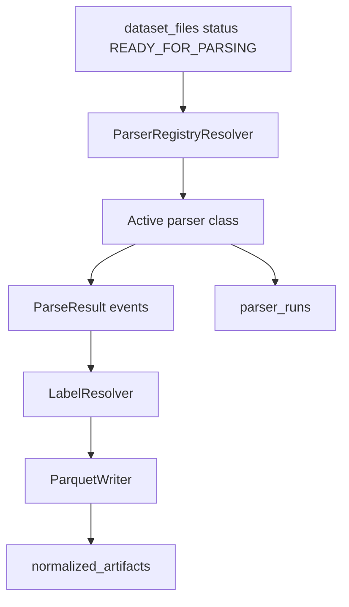

# Stage Two: Data Normalization

## Назначение

Stage Two превращает файловую коллекцию после Stage One в управляемый catalog + normalized Parquet artifacts. Основная цель слоя - сохранить traceability `raw -> normalized -> features -> model-ready`, не смешивать TRAIN/VALIDATION/TEST и подготовить основу для новых parser implementations.

## Пакеты Stage Two

| Пакет | Назначение |
|---|---|
| `scripts/stage_two/cli.py` | CLI router для Stage Two commands. |
| `storage/bootstrap.py` | Идемпотентное создание storage-директорий. |
| `ingestion/scanner.py` | Сканирование файлов, inference branch/role/source_format/dataset slug. |
| `ingestion/file_hash_service.py` | SHA-256 hashing raw files. |
| `ingestion/catalog_ingestion_service.py` | Создание ingestion runs и upsert datasets/dataset_files. |
| `parser_registry/seed.py` | Seed `schema_versions` и `parser_registry`. |
| `parser_registry/resolver.py` | Выбор активного parser entry по branch/source_format/role/priority. |
| `parsers/base.py` | Общие parser contracts (`ParsedEvent`, `ParseResult`, base classes). |
| `parsers/dns.py` | DNS parser implementations. |
| `parsers/host.py` | Host parser implementations для поддерживаемых structured/log formats. |
| `parsers/packet.py` | Packet-related parser support. |
| `parsers/bson.py` | BSON parser support. |
| `normalization/schema_contracts.py` | Загрузка/регистрация normalized schema contract. |
| `normalization/dns_service.py` | DNS normalization service. |
| `normalization/host_service.py` | Host normalization service. |
| `labels/resolver.py` | Label resolution from mapping rules/config/raw metadata. |
| `parquet/writer.py` | Запись Parquet artifacts. |
| `features/contracts.py`, `features/writer.py` | Feature artifact contract validation/writing APIs. |
| `model_ready/contracts.py`, `model_ready/registry.py` | Model-ready contract validation/registration APIs. |
| `duckdb/service.py` | DuckDB views/checks over Parquet artifacts. |
| `quality/checkers.py`, `quality/checks.py` | Data quality and leakage checks. |
| `traceability/service.py` | Восстановление chain от model-ready к raw. |
| `readiness_check.py` | Проверка готовности Stage Two окружения. |
| `e2e_dry_run.py` | End-to-end dry run на sample artifacts. |

## CLI-команды

| Команда | Что делает | Основные выходы |
|---|---|---|
| `stage-two bootstrap-storage` | Создает storage root и required directories. | Директории under `PATH_DATA_STORAGE`. |
| `stage-two catalog-ingest` | Сканирует configured roots и upsert-ит catalog rows. | `ingestion_runs`, `datasets`, `dataset_files`. |
| `stage-two seed-parser-registry` | Регистрирует normalized schema и parser entries. | `schema_versions`, `parser_registry`. |
| `stage-two normalize-dns [limit]` | Парсит READY DNS files и пишет normalized Parquet. | `parser_runs`, `normalized_artifacts`, Parquet. |
| `stage-two normalize-host [limit]` | Парсит READY host files и пишет normalized Parquet. | `parser_runs`, `normalized_artifacts`, Parquet. |
| `stage-two run-duckdb-checks` | Строит DuckDB analytics report. | JSON report, `data_quality_reports`. |
| `stage-two run-leakage-checks` | Проверяет leakage между ролями/artifacts. | JSON reports, `data_quality_reports`. |
| `stage-two trace-artifact <id-or-path>` | Печатает traceability chain. | JSON chain в stdout. |

## Нормализация

`normalize-dns` и `normalize-host` работают одинаково:

1. CLI выбирает `DatasetFileRepository.get_files_ready_for_parsing(branch, limit)`.
2. Service пытается найти active parser registry entry для `branch`, `source_format`, `role`.
3. Resolver не выбирает inactive entries. Planned parser entries остаются в registry для документации, но не участвуют в normalization.
4. Parser возвращает normalized events и counters.
5. Service пишет Parquet через `ParquetWriter`.
6. Service регистрирует `parser_runs` и `normalized_artifacts`, включая schema metadata и path/hash/counters.

## Schema versions

`seed-parser-registry` вызывает `seed_stage_two_metadata()`, который обязан зарегистрировать `normalized_event` schema в `schema_versions`. Parser registry entries ссылаются на `normalized_schema_name` и `normalized_schema_version`. Это обязательное условие для traceability и проверки readiness.

## Parser registry policy

- Активными должны быть только реально реализованные parser classes.
- Planned/unsupported parsers допускаются в registry только с `is_active=false` и config/status metadata.
- Resolver выбирает parser по branch/source_format/role с учетом priority и active flag.
- Для нового parser нужно добавить class, seed entry, schema linkage и тест/проверку, что resolver выбирает его только для поддерживаемого формата.

## Storage

Storage bootstrap создает структуру под raw, normalized, features, model-ready, reports, config и temp_data. Роли и branch разделяются на уровне путей и catalog metadata. Фактический список required directories находится в `scripts/stage_two/storage/bootstrap.py`.

## Quality и readiness

| Компонент | Назначение |
|---|---|
| `DuckDBAnalyticsService` | Создает views/checks над Parquet artifacts и пишет JSON report. |
| `LeakageChecker` | Проверяет риски data leakage между splits/artifacts. |
| `run_stage_two_readiness_check()` | Проверяет storage, DB, migrations/schema, parser registry, label config, catalog hashes и пишет readiness report. |

## Текущие границы Stage Two

- `catalog-ingest` регистрирует файлы, но не переводит их автоматически в `READY_FOR_PARSING` публичной CLI-командой.
- Feature/model-ready writer и registry APIs существуют, но общий production CLI pipeline для feature/model-ready сборки не реализован.
- Host netflow/wls planned parsers не активны.
