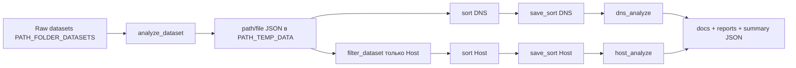

# Handlers Stage One

Stage One отвечает за filesystem inventory, фильтрацию, сортировку и content analysis DNS/Host датасетов. Он работает с raw/sorted файлами и JSON-картами, но не пишет PostgreSQL catalog и не создает normalized Parquet.

## Общий поток



## `json_handler` / `JsonDataManager`

Файл: `scripts/handlers/json_handler/json_data.py`.

`JsonDataManager` предоставляет минимальный контракт:

| Метод | Поведение |
|---|---|
| `ensure_directory()` | создает parent directory |
| `exists()` | проверяет наличие JSON file |
| `create(initial_data, overwrite=False)` | создает JSON, не перезаписывает без `overwrite=True` |
| `read(default=None)` | читает JSON object; если файла нет, возвращает default или `{}` |
| `write(data)` | полностью перезаписывает JSON; принимает только `dict` |
| `update(new_data)` | top-level merge и запись |

Пограничные случаи:

- JSON должен быть object/dict. List/scalar вызывает `ValueError`.
- Запись не атомарная: при аварийном завершении возможен частично записанный файл.
- Нет file locking; параллельные writes не защищены.

## `analyze_dataset`

Файлы:

- `scripts/handlers/analyze_dataset/dns_dataset_handler.py`
- `scripts/handlers/analyze_dataset/host_dataset_handler.py`
- `scripts/handlers/analyze_dataset/router_analyze.py`

Команды:

```bash
python manage.py handlers analyze-dataset dns-dataset-handler
python manage.py handlers analyze-dataset host-dataset-handler
```

Назначение: просканировать директории `PATH_DNS_DATASETS` или `PATH_HOST_DATASETS`, распределить файлы по ролям и сохранить path/name JSON.

Важно: handler проверяет наличие файла через filesystem walk, но не читает содержимое файлов.

### Выходной контракт DNS

Файлы:

- `PATH_TEMP_DATA/dns-path-file.json`
- `PATH_TEMP_DATA/dns-file.json`

Контракт:

```json
{
  "TRAIN": ["/abs/path/file1.csv"],
  "TEST": ["/abs/path/file2.csv"],
  "VALIDATION": ["/abs/path/file3.pcap"],
  "EXPERIMENTS": []
}
```

Роли определяются по токенам пути:

| Role | Keywords |
|---|---|
| `TRAIN` | `train`, `training` |
| `TEST` | `test`, `testing` |
| `VALIDATION` | `validation`, `valid`, `val`, `dev`, `eval` |
| `EXPERIMENTS` | fallback для DNS, если role tokens не найдены |

### Выходной контракт Host

Файлы:

- `PATH_TEMP_DATA/host-path-file.json`
- `PATH_TEMP_DATA/host-file.json`

Контракт:

```json
{
  "TRAIN": ["/abs/path/file1.log"],
  "TEST": ["/abs/path/file2.json"],
  "VALIDATION": ["/abs/path/file3.csv"]
}
```

Host fallback role в коде: `TEST`. Это риск: если путь не содержит role token, файл попадает в `TEST`. Для новых датасетов лучше не полагаться на fallback и обеспечить явные role directories.

Ошибки:

- пустой `PATH_*_DATASETS` -> `ValueError`;
- несуществующая директория -> `FileNotFoundError`;
- path не directory -> `NotADirectoryError`.

## `filter_dataset`

Файл: `scripts/handlers/filter_dataset/filter_host_dataset_handler.py`.

Команда:

```bash
python manage.py handlers filter-dataset filter-host-dataset-handler
```

Фильтрация реализована только для Host datasets. DNS filter отсутствует.

Вход:

- `PATH_TEMP_DATA/host-path-file.json`
- `PATH_TEMP_DATA/host-file.json`

Выход:

- `PATH_TEMP_DATA/filter_dataset-host-path-file.json`
- `PATH_TEMP_DATA/filter_dataset-host-file.json`
- `PATH_FILTER_LOG`

Фильтр обязателен перед Host sort, потому что `HostDatasetSortHandler` читает именно `filter_dataset-host-*.json`.

В коде зашиты whitelist rules:

| Role | Разрешенные datasets |
|---|---|
| `TRAIN` | `ADFA IDS`, `LID-DS 2021`, `Maintainable Log Dataset` |
| `VALIDATION` | `LID-DS 2019`, `LANL Dataset`, `Windows-Event-Log -OTRF-Security-Datasets` |
| `TEST` | `Unified-Host-Network-Dataset -LANL`, `ISOT-Cloud-IDS-Dataset`, `Dynamic-Malware-Analysis-Dataset` |

Примеры разрешенных suffix:

- ADFA: `.txt`, `.ghc`, `.csv`, `.netflow_ids`, `.xml`
- LID-DS 2021: `.sc`, `.json`
- OTRF: `.json`, `.cap`, `.pcap`, `.pcapng`
- ISOT: `.csv`
- Dynamic Malware: `.txt`, `.json`, `.bson`, `.log`

Технические риски:

- Извлечение имени датасета завязано на сегмент пути `host` и позицию `host/<role>/<dataset>`.
- Новые dataset names будут исключены без изменения кода.
- Whitelist не конфигурируется через JSON/YAML.
- Фильтр не проверяет содержимое файлов.

## `sort`

Файлы:

- `scripts/handlers/sort/sort_dns_dataset_handler.py`
- `scripts/handlers/sort/sort_host_dataset_handler.py`

Команды:

```bash
python manage.py handlers sort sort-dns-dataset-handler
python manage.py handlers sort sort-host-dataset-handler
```

Назначение: создать sorted tree:

```text
PATH_DNS_DATASETS_FILTER/
  TRAIN/<format>/
  TEST/<format>/
  VALIDATION/<format>/

PATH_HOST_DATASETS_FILTER/
  TRAIN/<format>/
  TEST/<format>/
  VALIDATION/<format>/
```

Материализация файла:

1. сначала `os.link` hardlink;
2. при ошибке fallback на `shutil.copy2`.

Коллизии имен решаются hash suffix по исходному пути. Если destination уже тот же file, он считается skipped existing.

Summary JSON:

- `PATH_TEMP_DATA/sort-dns-format-summary.json`
- `PATH_TEMP_DATA/sort-host-format-summary.json`

Summary fields:

```json
{
  "sorted_root_path": "...",
  "created_links_count": 0,
  "copied_files_count": 0,
  "skipped_existing_count": 0,
  "missing_source_count": 0,
  "name_mismatch_count": 0,
  "files_by_role_and_format": {
    "TRAIN": {"csv": 8}
  }
}
```

Ограничение: сортировка не регистрирует файлы в PostgreSQL. Catalog ingestion делает Stage Two.

## `save_sort`

Файлы:

- `scripts/handlers/save_sort/save_sort_dns_path_handler.py`
- `scripts/handlers/save_sort/save_sort_host_path_handler.py`

Команды:

```bash
python manage.py handlers save-sort save-sort-dns-dataset-handler
python manage.py handlers save-sort save-sort-host-dataset-handler
```

Назначение: обойти sorted tree и сохранить пути по `role/format`.

Выход:

- `PATH_TEMP_DATA/sort-path-dns-file.json`
- `PATH_TEMP_DATA/sort-path-dns-file-summary.json`
- `PATH_TEMP_DATA/sort-path-host-file.json`
- `PATH_TEMP_DATA/sort-path-host-file-summary.json`

Контракт:

```json
{
  "TRAIN": {
    "csv": ["/abs/sorted/TRAIN/csv/file.csv"],
    "pcap.csv": ["/abs/sorted/TRAIN/pcap.csv/file.pcap.csv"]
  },
  "TEST": {},
  "VALIDATION": {}
}
```

Эти JSON нужны для `dns_analyze` и `host_analyze`: content analyzers читают role/format bucket из `sort-path-*-file.json`.

## `dns_analyze`

Файлы:

- `scripts/handlers/dns_analyze/router_dns.py`
- `scripts/handlers/dns_analyze/run_action.py`
- `scripts/handlers/dns_analyze/analyze_dns_*_dataset_handler.py`

Actions:

| Action | Bucket |
|---|---|
| `analyze-train-csv-content` | DNS `TRAIN/csv` |
| `analyze-train-pcap-content` | DNS `TRAIN/pcap` |
| `analyze-train-pcap-csv-content` | DNS `TRAIN/pcap.csv` |
| `analyze-test-csv-content` | DNS `TEST/csv` |
| `analyze-test-pcap-content` | DNS `TEST/pcap` |
| `analyze-test-pcap-csv-content` | DNS `TEST/pcap.csv` |
| `analyze-validation-pcap-content` | DNS `VALIDATION/pcap` |
| `analyze-validation-txt-content` | DNS `VALIDATION/txt` |

Выход:

- analysis summary JSON в `PATH_TEMP_DATA`;
- RU/EN docs в `docs/{ru,en}/analysis-dataset/dns/<role>`;
- RU/EN reports в `PATH_REPORT/{ru,en}/stage-one/analysis-dataset/dns/<role>`.

## `host_analyze`

Файлы:

- `scripts/handlers/host_analyze/router_host.py`
- `scripts/handlers/host_analyze/run_action.py`
- `scripts/handlers/host_analyze/analyze_host_*_dataset_handler.py`

Actions покрывают train/validation/test buckets: `csv`, `json`, `json-1`, `log`, rotated logs, `cap`, `pcap`, `pcapng`, `bson`, `netflow_day`, `wls_day`, `txt`, `sc`, `ghc`, `xml`, Metricbeat-like logs.

Выход аналогичен DNS, но находится в `host/<role>`.

## Статусы анализа

Stage One docs используют статусы:

| Статус | Значение |
|---|---|
| `READY_FOR_FEATURE_EXTRACTION` | формат можно подключать к feature extraction после стандартной нормализации |
| `NEEDS_CUSTOM_PARSER` | нужен специализированный parser или schema-aware обработчик |
| `PARTIALLY_SUPPORTED` | часть структуры читается, но есть mixed schema/partial labels/нестабильность |
| `BROKEN_OR_EMPTY` | bucket пустой или непригоден для дальнейшего анализа |

Эти статусы не являются PostgreSQL enum для Stage Two. Они используются как input к parser strategy и ручной приоритизации.
