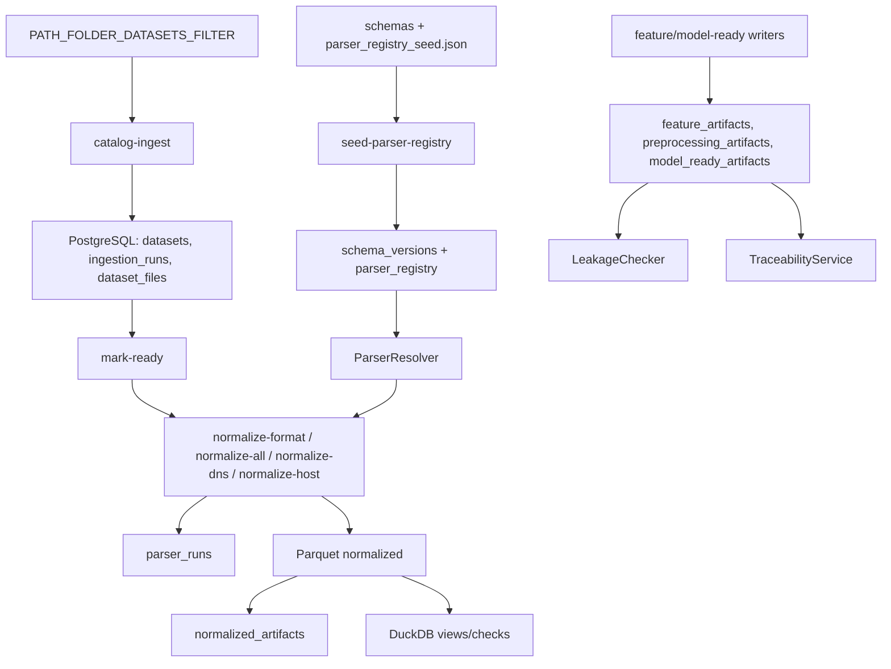

# Обзор Stage Two

Stage Two переводит sorted filesystem datasets в catalog-backed normalized artifacts. Цель: сохранить raw files неизменными, зарегистрировать metadata, выбрать parser, записать normalized events в Parquet и подготовить основу для feature/model-ready layers без leakage.

## Основные директории кода

```text
scripts/stage_two/
  cli.py
  storage/bootstrap.py
  ingestion/
  parser_registry/
  parsers/
  labels/
  normalization/
  parquet/
  features/
  model_ready/
  duckdb/
  quality/
  traceability/
  splitting/
  reports/
  readiness_check.py
  e2e_dry_run.py

scripts/db/
  config.py
  session.py
  models/
  repositories/
  migrations/

schemas/
  normalized/normalized_event_v1.json
  features/feature_artifact_v1.json
  model_ready/model_ready_v1.json
```

## Поток данных



## Инициализация storage

Файл: `scripts/stage_two/storage/bootstrap.py`.

Команда:

```bash
python manage.py stage-two bootstrap-storage
```

Создает обязательную структуру в `PATH_DATA_STORAGE`, не удаляя существующие файлы. Bootstrap идемпотентный: существующие directories попадают в `existing`, новые в `created`.

## Ingestion catalog

Файлы:

- `scripts/stage_two/ingestion/catalog_ingestion_service.py`
- `scripts/stage_two/ingestion/scanner.py`
- `scripts/stage_two/ingestion/file_hash_service.py`

Команда:

```bash
python manage.py stage-two catalog-ingest
```

Вход: `PATH_FOLDER_DATASETS_FILTER`.

Записывает:

- `ingestion_runs`;
- `datasets`;
- `dataset_files`.

Scanner определяет:

| Metadata | Источник |
|---|---|
| `branch` | части path: `dns`, `host`, `network`, `hybrid`; fallback `hybrid` |
| `role` | части path: `TRAIN`, `VALIDATION`, `TEST`; файлы без active role игнорируются |
| `source_format` | sorted bucket после role или filename suffix/compound suffix |
| `dataset_name` | path segment между branch и role, fallback `<branch>_<role>_<source_format>` |
| `dataset_slug` | lowercase slug |

Catalog ingestion рассчитывает SHA-256 потоковым чтением и делает upsert файлов по `(dataset_id, file_path)`.

Назначение статусов:

- `REGISTERED` по умолчанию;
- `EMPTY_FILE` для файлов нулевого размера;
- `UNSUPPORTED_FORMAT`, если inferred format находится вне known formats.

## Seed parser registry

Файлы:

- `scripts/stage_two/parser_registry/parser_registry_seed.json`
- `scripts/stage_two/parser_registry/seed.py`
- `scripts/stage_two/parser_registry/resolver.py`
- `scripts/stage_two/normalization/schema_contracts.py`

Команда:

```bash
python manage.py stage-two seed-parser-registry
```

Действия:

1. Загружает `schemas/normalized/normalized_event_v1.json`.
2. Делает upsert row в `schema_versions` для `normalized_event/v1`.
3. Разворачивает compact parser seed groups в rows `parser_registry`.
4. Валидирует `parser_module.parser_class`.
5. Если active parser class отсутствует или не является `BaseParser`, row сохраняется с `is_active=false` и диагностикой в `config_json`.

## Разрешение parser

`ParserResolver` выбирает active parser по правилу:

```text
branch + source_format + (supported_role == role OR supported_role IS NULL)
ORDER BY priority ASC, id ASC
```

Если parser не найден, `resolve_or_mark_unsupported()` помечает `dataset_files.status='UNSUPPORTED_FORMAT'`.

## Сервисы normalization

Файлы:

- `scripts/stage_two/normalization/dns_service.py`
- `scripts/stage_two/normalization/host_service.py`
- `scripts/stage_two/normalization/runner.py`
- `scripts/stage_two/normalization/options.py`

Команды:

```bash
python manage.py stage-two normalize-format --branch dns --role TRAIN --format csv --limit 10
python manage.py stage-two normalize-all --branch host --limit 100
python manage.py stage-two normalize-dns 10
python manage.py stage-two normalize-host 10
```

`normalize-format` и `normalize-all` являются более контролируемыми routes: они не смешивают роли и форматы. Legacy `normalize-dns/host` выбирают ready files по branch.

Поток normalization:

1. Выбрать `dataset_files.status='READY_FOR_PARSING'`.
2. Разрешить parser metadata и schema version.
3. Создать или возобновить `parser_runs`.
4. Создать parser с `LabelResolver`.
5. Собрать `ParserContext`.
6. Потоково читать parse batches.
7. Записать normalized Parquet parts через `ParquetArtifactWriter`.
8. Зарегистрировать `normalized_artifacts`.
9. Завершить `parser_runs`.
10. Обновить `dataset_files.status`.
11. Сохранить parser run reports.

Маппинг статусов parser/file:

| Результат parser | `parser_runs.status` | `dataset_files.status` |
|---|---|---|
| все строки распарсены | `SUCCESS` | `PARSED` |
| часть строк распарсена, часть завершилась ошибкой | `PARTIAL_SUCCESS` | `PARTIALLY_PARSED` |
| ошибка чтения или нет распарсенных строк | `FAILED` | `FAILED` |
| пустой файл | `SKIPPED` | `EMPTY_FILE` |
| unsupported format | `SKIPPED` | `UNSUPPORTED_FORMAT` |
| намеренно пропущенный helper file | `SKIPPED` | `SKIPPED` |

## Разрешение labels

Файл: `scripts/stage_two/labels/resolver.py`.

Resolver возвращает canonical label fields для каждого normalized event. Отсутствующие labels преобразуются в:

```json
{
  "label_binary": null,
  "label_family": null,
  "label_subtype": null,
  "label_source": "none",
  "label_status": "unlabeled",
  "label_confidence": null,
  "label_mapping_rule_id": null
}
```

Filename и embedded label hints отключены для `TEST` через `label_hints_allowed()`.

## Запись Parquet

Файл: `scripts/stage_two/parquet/writer.py`.

Записывает:

- normalized events;
- feature rows;
- model-ready tables.

Compression по умолчанию: `zstd`.

PostgreSQL хранит только artifact metadata и paths. Большие данные остаются в Parquet.

## Сервисы feature и model-ready

Файлы:

- `scripts/stage_two/features/contracts.py`
- `scripts/stage_two/features/writer.py`
- `scripts/stage_two/model_ready/contracts.py`
- `scripts/stage_two/model_ready/registry.py`

Текущее состояние:

- feature writer может писать prepared rows и регистрировать `feature_artifacts`;
- model-ready registry может писать/регистрировать X/y/sequence/split/preprocessing artifacts;
- orchestration feature extraction пока не оформлена как полный CLI pipeline;
- contracts enforce X excluded/forbidden columns и TRAIN-only preprocessing fit.

## DuckDB и проверки

Файлы:

- `scripts/stage_two/duckdb/service.py`
- `scripts/stage_two/duckdb/sql/create_views.sql`
- `scripts/stage_two/quality/checkers.py`

Команды:

```bash
python manage.py stage-two run-duckdb-checks
python manage.py stage-two run-leakage-checks
```

DuckDB views:

- `normalized_all`;
- `features_all`;
- `model_ready_all`.

Проверки покрывают row counts, required columns, split contamination, schema mismatch, nulls, duplicates, role/branch domains, forbidden X columns, отсутствие TEST в TRAIN artifacts и preprocessing fit role.

## Traceability

Файл: `scripts/stage_two/traceability/service.py`.

Команда:

```bash
python manage.py stage-two trace-artifact <model_ready_id_or_artifact_path>
```

Traceability разрешает цепочку:

```text
model_ready_artifacts.feature_artifact_id
  -> feature_artifacts.id
  -> feature_artifacts.normalized_artifact_id
  -> normalized_artifacts.id
  -> normalized_artifacts.parser_run_id
  -> parser_runs.id
  -> parser_runs.file_id
  -> dataset_files.id
  -> dataset_files.dataset_id
  -> datasets.id
```

Если любая связь отсутствует, `TraceabilityError` объясняет недостающий link.

## Readiness и dry run

В репозитории есть `scripts/stage_two/readiness_check.py` и `scripts/stage_two/e2e_dry_run.py`. Они относятся к слоям operational validation. Основные production contracts при этом задаются CLI, ORM, schemas, parser registry и tests в `tests/stage_two`.

## Ограничения текущей реализации

- Orchestration feature extraction не полностью оформлена как end-to-end CLI stage.
- Model-ready creation есть как registry/writer service, но нет полноценной команды сборки X/y для всех branches.
- `normalize-dns/host` legacy routes менее управляемы, чем `normalize-format`.
- Некоторые Stage One docs могут иметь статус `NEEDS_CUSTOM_PARSER`, даже если Stage Two уже содержит parser class для части формата; решающим является active parser registry + parser coverage.
## Performance execution architecture

Stage Two normalization теперь имеет performance-oriented execution layer без изменения normalized event contract.

Основные файлы:

- `scripts/stage_two/execution/work_unit.py`;
- `scripts/stage_two/execution/planner.py`;
- `scripts/stage_two/execution/executor.py`;
- `scripts/stage_two/execution/runtime_settings.py`;
- `scripts/stage_two/execution/retry_policy.py`;
- `scripts/stage_two/execution/progress.py`;
- `scripts/stage_two/execution/format_policy.py`;
- `scripts/stage_two/benchmark.py`;
- `scripts/stage_two/quality/post_run_validation.py`.

Ключевое поведение:

- `WorkUnitPlanner` строит работу только для `dataset_files.status=READY_FOR_PARSING` и одного точного `branch/role/source_format`.
- `WorkUnitExecutor` использует `ProcessPoolExecutor` для CPU parsing и bounded future submission.
- Workers не делят одну SQLAlchemy session; каждый process открывает собственный DB/session context только там, где нужно.
- Resume пропускает successful normalized artifacts с подходящими parser/schema versions.
- Parser failures изолируются на уровне file/chunk и могут давать `PARTIAL_SUCCESS` для команды.
- Parsers используют `parse_batches` для streaming/batch parsing там, где возможно.
- Большие line-based files можно делить на registered chunks с parent trace metadata.
- Binary formats (`cap`, `pcap`, `pcapng`, `bson`) не делятся обычным line splitter.
- `ParquetArtifactWriter` пишет через atomic temp-file и валидирует output до artifact registration.
- `benchmark-normalization` измеряет throughput и оценивает достижимость `17 GB <= 3 hours`.
- `normalize-format` создает post-run validation report по counts, reconciliation, split separation, leakage и traceability.

Resource profiles:

| Profile | workers | batch_size | max_output_part_rows |
| --- | ---: | ---: | ---: |
| `safe` | 4 | 50000 | 100000 |
| `balanced` | 8 | 100000 | 250000 |
| `fast` | 12 | 200000 | 500000 |
| `aggressive` | 14 | 300000 | 750000 |

Format policy ограничивает рискованные форматы:

- PCAP/PCAPNG/CAP: low workers и `packet-summary` by default.
- BSON: low workers и moderate batches.
- JSON/JSONL: moderate workers.
- line-based logs/TXT/syscall traces: fast settings после benchmark validation.

Operational target:

- required throughput для 17 GB за 3 часа: около `5.67 GB/hour`;
- target на i7-14700KF / 64 GB RAM / M.2 SSD: `10-20+ GB/hour` для line-based formats;
- GPU остается extension point для feature/model-ready/training, а не default raw parser engine.

Safety invariants не меняются: raw files immutable, splits separate, `TEST` не используется для training/fit/tuning, labels не являются X features, missing labels/timestamps сохраняют explicit null/missing semantics, traceability остается полной.
