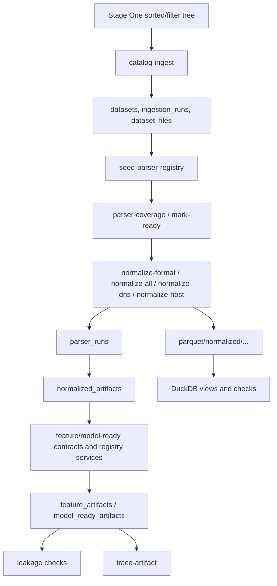

# Stage Two / нормализация данных

Раздел описывает фактическую реализацию Stage Two: catalog ingestion, parser registry, нормализацию DNS/Host файлов в normalized events, запись Parquet artifacts, PostgreSQL Catalog, DuckDB/data quality/leakage checks и traceability. Документы предназначены для разработчика, который должен запускать pipeline, добавлять parser implementations и проверять, что данные не смешивают роли и не создают leakage.

## Границы Stage Two

Stage Two начинается после Stage One, когда исходные файлы уже разложены в sorted/filter tree. Raw-файлы не изменяются: Stage Two читает их, регистрирует metadata в PostgreSQL и создает новые артефакты в `PATH_DATA_STORAGE`.

Фактически реализованные части:

| Область | Реализация | Документ |
| --- | --- | --- |
| CLI/routing | `manage.py`, `scripts/router_script.py`, `scripts/stage_two/cli.py` | [usage_guide.md](usage_guide.md) |
| Storage bootstrap | `scripts/stage_two/storage/bootstrap.py` | [storage_architecture.md](storage_architecture.md) |
| Catalog ingestion | `scripts/stage_two/ingestion/*` | [postgresql_catalog_schema.md](postgresql_catalog_schema.md) |
| Parser registry/resolver | `scripts/stage_two/parser_registry/*` | [parser_strategy.md](parser_strategy.md) |
| Parser development | `scripts/stage_two/parsers/*` | [parser_development_guide.md](parser_development_guide.md) |
| Label resolver | `scripts/stage_two/labels/resolver.py` | [label_resolver.md](label_resolver.md) |
| Normalized schema | `schemas/normalized/normalized_event_v1.json` | [normalized_event_schema.md](normalized_event_schema.md) |
| Parquet/DuckDB | `scripts/stage_two/parquet/*`, `scripts/stage_two/duckdb/*` | [parquet_duckdb_artifacts.md](parquet_duckdb_artifacts.md) |
| Quality checks | `scripts/stage_two/quality/checkers.py` | [data_quality_checks.md](data_quality_checks.md) |
| Leakage prevention | feature/model-ready contracts, `LeakageChecker` | [data_leakage_prevention.md](data_leakage_prevention.md) |
| Traceability | `scripts/stage_two/traceability/service.py` | [traceability.md](traceability.md) |
| Performance/runbooks | normalization options, large-file split, recovery steps | [performance_tuning.md](performance_tuning.md), [runtime_resource_runbook.md](runtime_resource_runbook.md) |

Не реализовано как отдельная CLI-команда в текущем роутере: полноценный build step для feature artifacts и model-ready artifacts. Для них есть contracts, writers/registry services и e2e dry-run, но operational CLI сейчас покрывает catalog, parser readiness, normalization, DuckDB checks, leakage checks и traceability.

## Рекомендуемый порядок чтения

1. [usage_guide.md](usage_guide.md) - как запустить Stage Two и какие команды реально поддерживает CLI.
2. [storage_architecture.md](storage_architecture.md) - что должно быть в `PATH_DATA_STORAGE`.
3. [postgresql_catalog_schema.md](postgresql_catalog_schema.md) - какие metadata и связи хранятся в PostgreSQL.
4. [parser_strategy.md](parser_strategy.md) и [parser_development_guide.md](parser_development_guide.md) - как выбирается parser и как добавить новый.
5. [normalized_event_schema.md](normalized_event_schema.md) и [label_resolver.md](label_resolver.md) - контракт normalized event и правила labels.
6. [parquet_duckdb_artifacts.md](parquet_duckdb_artifacts.md), [data_quality_checks.md](data_quality_checks.md), [data_leakage_prevention.md](data_leakage_prevention.md), [traceability.md](traceability.md) - артефакты, проверки и lineage.
7. [performance_tuning.md](performance_tuning.md), [runtime_resource_runbook.md](runtime_resource_runbook.md), [final_summary_template.md](final_summary_template.md) - эксплуатация, восстановление и итоговая отчетность.

## Основные инварианты

1. Raw-файлы датасетов не изменяются.
2. `TRAIN`, `VALIDATION` и `TEST` не смешиваются в одном normalized/feature/model-ready artifact.
3. `TEST` не используется для обучения, fit preprocessing, fit scaler, fit encoder, threshold tuning или feature selection.
4. PostgreSQL хранит metadata, статусы, связи, пути, хеши и отчеты; большие normalized/features/model-ready таблицы хранятся в Parquet.
5. DuckDB используется для аналитических SQL-проверок поверх Parquet.
6. Labels хранятся отдельно от X-признаков.
7. Leakage/source/label поля не должны попадать в model-ready `X` artifacts.
8. Все артефакты должны сохранять traceability: `raw -> normalized -> features -> model-ready`.
9. Отсутствующий label не означает benign.
10. Filename heuristics для `TEST` labels отключены.
11. Отсутствующий timestamp нельзя заменять текущим временем; нужно сохранять `timestamp = null` и `timestamp_type = "missing"` либо `event_order`, если доступен порядок события.

## Основные команды

Все команды проходят через `manage.py`:

```bash
python manage.py stage-two bootstrap-storage
python manage.py stage-two catalog-ingest
python manage.py stage-two seed-parser-registry
python manage.py stage-two parser-coverage [dns|host|network|hybrid]
python manage.py stage-two mark-ready --branch host --role TRAIN --format auth.log --dry-run
python manage.py stage-two mark-ready --branch host --role TRAIN --format auth.log --apply
python manage.py stage-two normalize-format --branch host --role TRAIN --format auth.log --limit 100
python manage.py stage-two normalize-all --branch host --limit 1000
python manage.py stage-two split-large-files --branch host --role TRAIN --format csv --max-part-size-mb 512 --apply --register
python manage.py stage-two normalize-dns 10
python manage.py stage-two normalize-host 10
python manage.py stage-two run-duckdb-checks
python manage.py stage-two run-leakage-checks
python manage.py stage-two trace-artifact <model_ready_id_or_artifact_path>
```

Миграции и модульные проверки запускаются отдельно:

```bash
alembic -c scripts/db/migrations/alembic.ini upgrade head
python -m scripts.db.smoke_check
python -m scripts.stage_two.readiness_check
python -m scripts.stage_two.e2e_dry_run
```

## Pipeline



## Терминология

| Термин | Значение |
| --- | --- |
| branch | Модальность или ветка данных: `dns`, `host`, `network`, `hybrid`. Нормализация сейчас поддерживает `dns` и `host`. |
| role | Split датасета: `TRAIN`, `VALIDATION`, `TEST`. `EXPERIMENTS` есть в DB constraint, но catalog scanner Stage Two активирует только `TRAIN/VALIDATION/TEST`. |
| source_format | Формат исходного файла: `csv`, `pcap`, `pcap.csv`, `json`, `txt`, `bson`, `auth.log`, `netflow_day` и т.д. |
| normalized event | Одна нормализованная запись по контракту `normalized_event/v1`. |
| parser run | Запуск parser для одного `dataset_files.id`. |
| artifact | Parquet или внешний файл, зарегистрированный в catalog metadata. |
