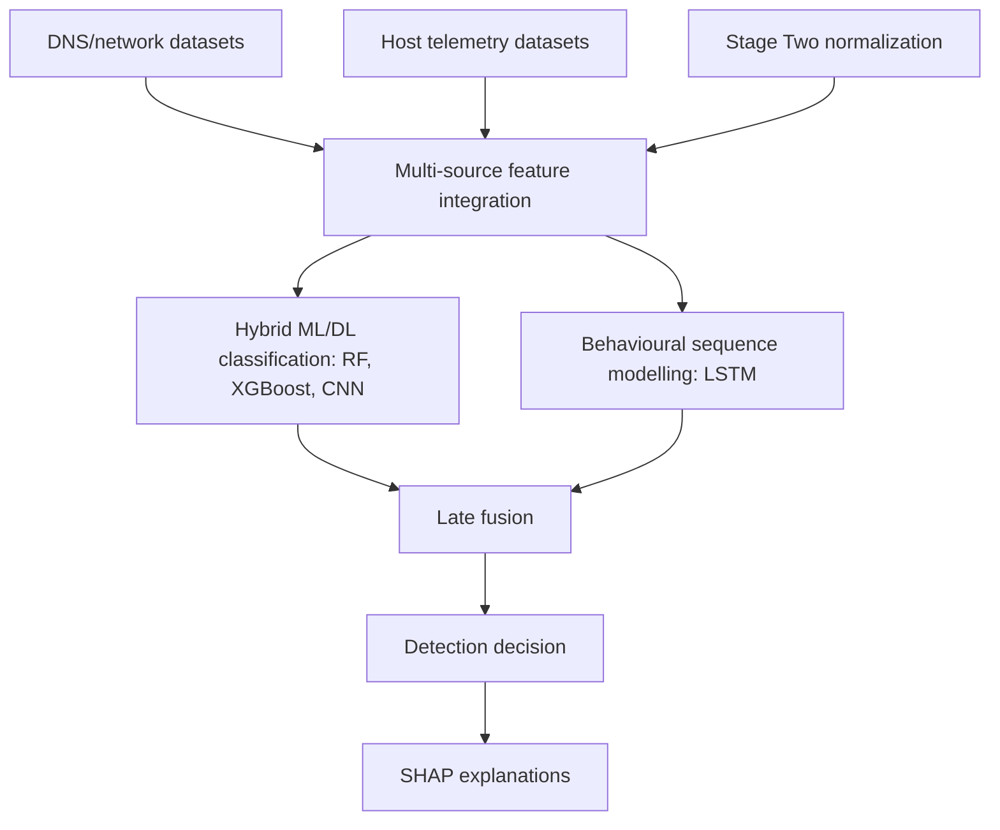

# Обзор проекта и research context

Документ объединяет сведения из `project_proposal_analysis.md` и `functional_project_cheatsheet.md`. Он описывает proposal-level замысел проекта и отделяет исследовательский план от фактической реализации репозитория.

## Назначение

Проект посвящен теме **Behaviour-driven hybrid learning for data exfiltration detection**. Цель исследования — спроектировать и оценить гибридный ML/DL framework для обнаружения многоэтапной эксфильтрации данных с использованием:

- DNS и network признаков;
- host-level telemetry;
- behavioural sequence modelling;
- explainability через SHAP;
- role-separated dataset strategy для `TRAIN`, `VALIDATION`, `TEST`.

## Research gap

Исходные документы фиксируют один и тот же исследовательский разрыв:

| Ограничение существующих подходов | Последствие |
| --- | --- |
| Single-modality detection: только network или только host. | Модель видит неполный жизненный цикл атаки. |
| Event-level classification без последовательностей. | Многоэтапная эксфильтрация может быть обнаружена поздно или фрагментарно. |
| Слабая explainability. | SOC analyst не видит, какие признаки привели к решению. |
| Несовместимость публичных датасетов. | Нельзя безоговорочно выполнять raw fusion host/network логов. |

Вывод: multi-source integration должна выполняться на уровне признаков, временных окон, normalized events и traceability, а не через механическое объединение raw logs.

## Proposal-level архитектура

| Слой | Назначение | Статус |
| --- | --- | --- |
| Multi-source integration | Нормализация host/network признаков в единое представление. | Proposal / Stage Two design target. |
| Hybrid ML/DL classification | Random Forest, XGBoost, CNN для structured/local feature patterns. | Proposal; модельный код не подтвержден. |
| Behavioural sequence modelling | LSTM по ordered event sequences. | Proposal; sequence builder/model code не подтвержден. |
| Late fusion | Агрегация вероятностей classifier и sequence model. | Proposal; веса/формула не заданы. |
| SHAP explainability | Global/local explanations и rank-order consistency. | Proposal; SHAP variants не зафиксированы. |

## Research questions

| ID | Вопрос | Что должен дать для реализации |
| --- | --- | --- |
| RQ1 | Какие cross-domain признаки host/network характеризуют стадии эксфильтрации? | Feature catalogue и dataset-feature map. |
| RQ2 | Как объединить classical ML и DL в hybrid architecture? | Baseline classifiers, CNN branch, сравнение ablation. |
| RQ3 | Как встроить behavioural sequence modelling? | Sequence window builder, LSTM branch, event ordering. |
| RQ4 | Как XAI повышает interpretability и помогает расследованию? | SHAP reports, fold consistency, case studies. |

## Aim and objectives

Цель: разработать и оценить behaviour-driven hybrid ML framework для обнаружения data exfiltration, объединяющий host telemetry, network features, behavioural sequence modelling и explainable AI.

Задачи:

1. Определить host-level и network-level признаки для data exfiltration detection.
2. Спроектировать hybrid ML/DL detection architecture: RF, XGBoost, CNN, LSTM.
3. Реализовать behavioural sequence modelling для temporal attack patterns.
4. Интегрировать SHAP-based explainability.
5. Оценить framework на public cybersecurity benchmark datasets.

## Scope

| Входит в scope | Вне текущего scope |
| --- | --- |
| Public benchmark datasets. | Live traffic capture. |
| RF, XGBoost, CNN, LSTM. | RL components. |
| Feature-level host/network integration. | Large-scale raw multi-dataset fusion. |
| Supervised/semi-supervised sequence modelling. | Fully unsupervised sequence modelling. |
| SHAP explainability. | Полная SOC product integration. |

## Methodology

Proposal использует **Design Science Research (DSR)**:

1. Feature identification and dataset preparation.
2. Hybrid framework design.
3. Behavioural sequence modelling.
4. Explainability integration.
5. Evaluation and validation.

Плановый timeline: 12 недель, май-август 2026.

| Фаза | Key deliverable | Целевая дата |
| --- | --- | --- |
| Phase 1 | Preprocessed feature dataset with MITRE ATT&CK mappings. | May 15 |
| Phase 2 | Hybrid detection framework prototype. | June 12 |
| Phase 3 | Integrated LSTM sequence modelling component. | July 3 |
| Phase 4 | SHAP explanation module. | July 24 |
| Phase 5 | Experimental results report with comparative analysis. | August 14 |
| Report writing | Completed report and slides. | August 28 |

## Evaluation plan

| Элемент | Proposal-level решение | Gap реализации |
| --- | --- | --- |
| Metrics | Accuracy, precision, recall, F1-score, FPR, AUC. | Модельный evaluation код не подтвержден. |
| Validation | Stratified k-fold cross-validation. | Значение `k` не задано. |
| Ablation | Full hybrid vs individual components. | Ablation experiments не реализованы. |
| Baselines | RF only, XGBoost only, CNN only, LSTM only, hybrid without SHAP. | Конкретные baseline configs отсутствуют. |
| Explainability | SHAP explanations for TP/FP and fold rank stability. | TreeSHAP/DeepSHAP/KernelSHAP не выбраны. |

## Proposal risks

| Риск | Последствие | Митигирующая мера |
| --- | --- | --- |
| Несовместимость host и network datasets. | Нельзя доказать прямую raw-level корреляцию. | Использовать feature-level integration и явно документировать ограничения. |
| Class imbalance. | Accuracy может быть вводящей в заблуждение. | Делать precision/recall/F1 основными метриками. |
| Sequence model underperformance. | LSTM может не улучшить baseline. | Добавить temporal aggregation fallback и ablation. |
| Compute constraints. | DL experiments могут быть ограничены. | Использовать Colab/Kaggle или упрощенные модели. |
| Weak explainability design. | SHAP может объяснять proxy/leakage признаки. | Исключить leakage fields и проверять SHAP stability. |

## Что является фактом, а что proposal

| Категория | Статус |
| --- | --- |
| Stage One dataset preparation, sorting, JSON path maps. | Подтверждено текущим репозиторием. |
| Stage Two normalization/catalog/parquet/parser design. | Частично реализовано/задокументировано в Stage Two документации; проверять по коду. |
| RF/XGBoost/CNN/LSTM training. | Proposal-level, в QA документе модельная реализация не подтверждена. |
| SHAP explanations. | Proposal-level. |
| Feature catalogue. | Архитектурный контракт для будущей реализации feature extraction. |
